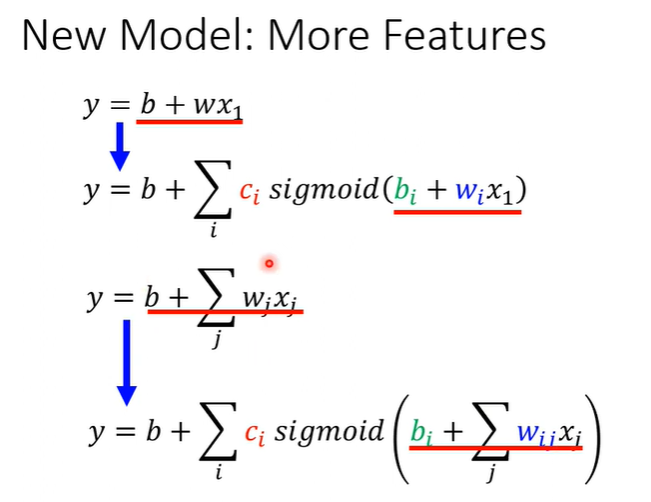
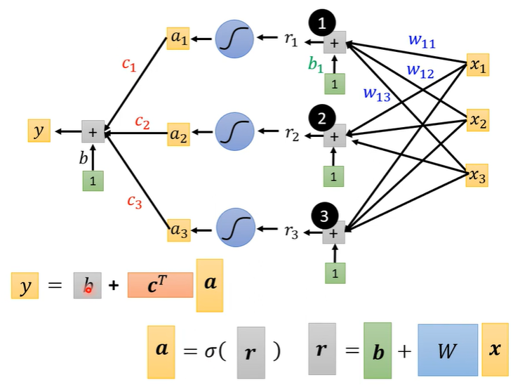
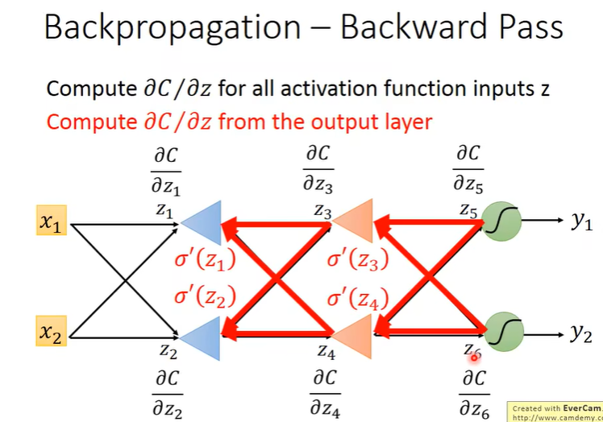

# 0. introduction

1. 什么是机器学习？

   简单的来说机器学习就是探索一个复杂的函数，使用这个函数来解决某一个具体的问题。深度学习就是使用一个类神经网络来搭建函数。根据不同的问题，这个函数有不同的输入和输出。

   

2. 机器如何寻找这样一个函数呢？

   - 监督学习（supervised learning）——数据需要打上标签
   - 自监督学习（self-supervised learning）——通过使用一些没有标注的数据进行**pre-train**
   - 生成式对抗网络（generative adversarial network）——不需要成对的数据集，只需要大量的输入和大量的输出
   - 强化学习（reinforcement learning）——数据集不容易打上标签，但是可以通过奖惩进行机器的训练

3. 其他内容

   - 异常检测（anomaly detection）——例如，在分类问题中，机器能回答出该输入不属于规定的分类
   - 可解释性AI（explainable AI）——机器是根据什么得到结果的
   - 模型攻击（model attack）——添加一点很小的噪声，就可以影响函数的输出结果
   - 域适应（domain adaption）——训练数据和测试数据的分布可能不同
   - 模型压缩（network compression）
   - 终生学习（life-long learning）
   - 元学习（meta learning）

# 1. 基本概念

## 1. 机器学习的分类

- 回归（regression）：函数的输出为一个标量（scalar）

- 分类（classification）：

- 结构化学习（structure learning）：机器学习要生成一个结构化结果，例如一幅图片，一篇文章

## 2. 如何生成一个简单的模型

- 定义一个模型：$y=wx+b,w:weight,b:bias$

- 定义损失函数$Loss=L(w,b)$——用来评估未知参数取值的优劣。

  

- 优化（optimization）：$w^*,b^*=arg\min_{w,b}L$

  ——梯度下降（gradient descent）

  

## 3. 更加复杂的模型

**线性模型**（linear model）——$y=wx+b$，线性模型太过简单导致无法模拟现实中更加复杂的情况，因此需要更加复杂的模型


$sigmoid\ function:y=c\frac{1}{1+e^{-b+wx}}=c\ sigmoid(b+wx)$

 

**通过改变$b,w,c$的值就可以拟合不同情况下的曲线**

$y=b+\sum_{i}c_isigmoid(b_i+w_ix)$，当有更多的特征（feature）时====>$y=b+\sum_ic_isigmoid(b_i+\sum_jw_{ij}x_{j})$



使用矩阵进行表示：




------

在上面的步骤中，将简单的线性模型扩展为一个含有很多参数$\theta$的复杂模型.

损失函数——根据未知参数$\theta,L=Loss(\theta)$

优化——寻找一组参数，式损失函数最小：$\theta^*=arg\min_{min}L$

- 在梯度下降的过程中，对每一个参数进行微分，记作梯度$g=\nabla L(\theta^0)$

  

- 在训练过程中，将训练集分为大小为$Batchsize的n个batch$ ，将所有$batch$ 都训练完成后，称为一个$epoch$结束


------

为了拟合不同复杂的关系，不光有$sigmoid$函数，还有$Relu$函数


在机器学习中**将$sigmoid，Relu$称为激活函数**（activation function） 

深度神经网络——多层的神经元（neuron）结构——**多层的hidden layer**就是Deep neural network


# 2. 深度学习简介

1958 感知机（perceptron）——一种线性模型 ====> 1980s 多层感知机multi-layer perceptron ===> 2009 GPU加速训练

## 1. 结构

- 全连接层（fully connected）


- 输入层===> 隐藏层 ===> 输出层

  

- $Loss$函数——交叉熵（cross entropy）

- $Gradient\ descent$——梯度下降

  

## 2. 反向传播

反向传播（back propagation）就是一种高效的算法能够在梯度下降中能够更加便捷地计算出大量参数的微分

- 链式法则

  

  

- 要计算损失函数关于某个参数的微分，即$\frac{\partial C}{\partial w}$，分为前向过程（forward pass），和反向过程（backward pass）


- $\frac{\partial z }{\partial w}$===>前一层的输入；

  $\frac{\partial C}{\partial z}=\frac{\partial a}{\partial z}\frac{\partial C}{\partial a}，\frac{\partial a}{\partial z}$是sigmoid函数的微分，$\frac{\partial C}{\partial a}$是后一层的微分，**因此问题的关键就是如何计算出$\frac{\partial C}{\partial z^,}和\frac{\partial C}{\partial z^{''}}$**

  

  

- 前向过程：上一层的输入

  反向过程：**从output layer向前算**

  

  

# 3. pytorch

pytorch是一种python中适用于机器学习的一种框架，

- 使用GPU加速高维矩阵（tensor）的计算
- 使用很简便的方式进行参数的微分（梯度的计算）


## 1. 载入数据

- Dataset：载入数据和对应的标签

- Dataloader：将dataset中的数据合并为一个个的batch

  ~~~python
  dataset = MyDataset（file）
  dataloader = Dataloader（dataset， batch_size, shuffle = True）
  ```
  shuffle：洗牌，将输入数据的顺序打乱，使得数据更有独立性
  一般来说在训练时，shuffle = True；在测试时，shuffle = False
  ```
  ~~~

```python
fron torch.utils.data import Dataset, Dataloader
class Mydataset(Dataset):
    # 读数据
    def __init__(self, file):
        self.data = 
    # 返回一个数据
    def __getitem__(self, index):
        return self.data[index]
    # 返回数据集的大小
    def __len__(self):
        return len(self.data)
    
```


## 2. Tensor


- .shape( )

  返回tensor的维数大小

  

- 创建tensor

  - ```python
    x = torch.tensor([[1, 1],[-1, -1]])
    ```

  - ```python
    x = torch.from_numpy(np.array([[1, 1],[-1, -1]]))
    ```

  - ```python
    x = torch.zeors(2,2)
    ```

  - ```python
    x = torch.ones(2, 2)
    ```

- 运算

  ```python
  # tensor的运算实际上是矩阵的运算
  z = x + y
  z = x - y
  y = x.pow(2) # 幂运算
  y = x.sum()
  y = x.mean()
  x = x.transpose(0, 1) # 转置，将第0个维度和第1个维度进行互换
  x = x.squeeze(0) # 将某个长度为1的维度去掉，实现降维
  ```

  

  ```python
  x = x.unsqueeze(1)
  ```

  

  ```python
  w = torch.cat([x,y,z], dim = 1) # tensor的合并，dim=1，表明按照第一个维度作合并
  ```

  

  ```python
  # 使用GPU or CPU进行运算
  x = x.to('cpu')
  x = x.to('cuda')
  torch.cuda.is_availabe()
  ```

- 梯度计算

  ```python
  z.backward()
  x.grad
  ```

  

## 3. 定义神经网络


```python
layer = torch.nn.linear(32, 64) # 这一层有64个神经元
layer.weight.shape ===> torch.size([64, 32])
layer.bias.shape ===> torch.size([64])

nn.Sigmoid()
nn.ReLU()
```


```python
import torch.nn as nn
class MyModel(nn.Module):
    # 定义自己的网络
    def __init__(self):
        super(MyModel, self).__init__()
        self.net = nn.Sequential(
        	nn.Linear(10, 32),
        	nn.Sigmoid(),
        	nn.Linear(32, 1)
        )
   	# 输出输出层的结果
    def forward(self, x):
        return self.net(x)
    
# 除了使用***Sequential( )****以外，还可以一层层的定义
class MyModel(nn.Module):
    # 定义自己的网络
    def __init__(self):
        super(MyModel, self).__init__()
        self.layer1 = nn.Linear(10, 32),
        self.layer2 = nn.Sigmoid(),
        self.layer3 = nn.Linear(32, 1)
       
   	# 输出输出层的结果
    def forward(self, x):
        out = self.layer1(x)
        out = self.layer2(x)
        out = self.layer3(x)
        return out
```

## 4. 定义损失函数

~~~python
```
criterion : 标准
```
# 平均平方差 mean squared error
criterion = nn.MSELoss() 

# 交叉熵 cross entropy
criterion = nn.CrossEntropyLoss()

loss = criterion(model_output, expected_value)
~~~

## 5. Optimization

**如何利用不同的基于梯度下降的算法进行参数的更新**

- 随机梯度下降（stochastic gradient descent）

  ```python
  optimizer = torch.optim.SGD(model.parameters(), lr, momentum = 0) 
  ```

  

  关于momentum参数的理解参考地址：https://blog.csdn.net/weixin_43687366/article/details/108214854


## 6. 总结

1. 载入数据


2. 模型训练


3. 测试


4. 保存和载入模型

   ```python
   torch.save(model.state_dict(), path)
   
   ckpt = torch.load(path)
   model.load_state_dict(ckpt)
   ```

