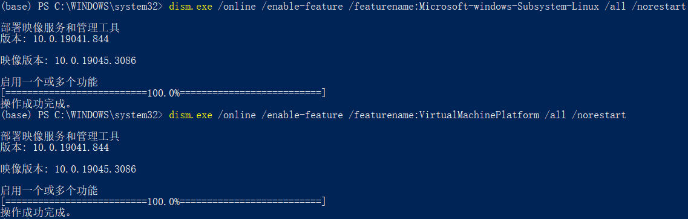
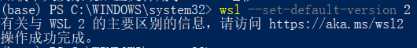
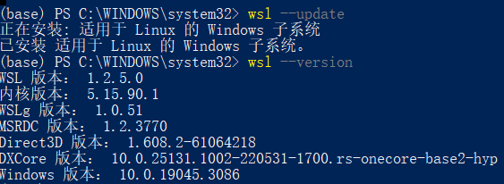
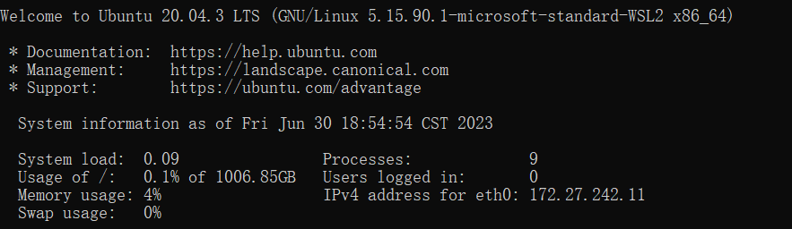
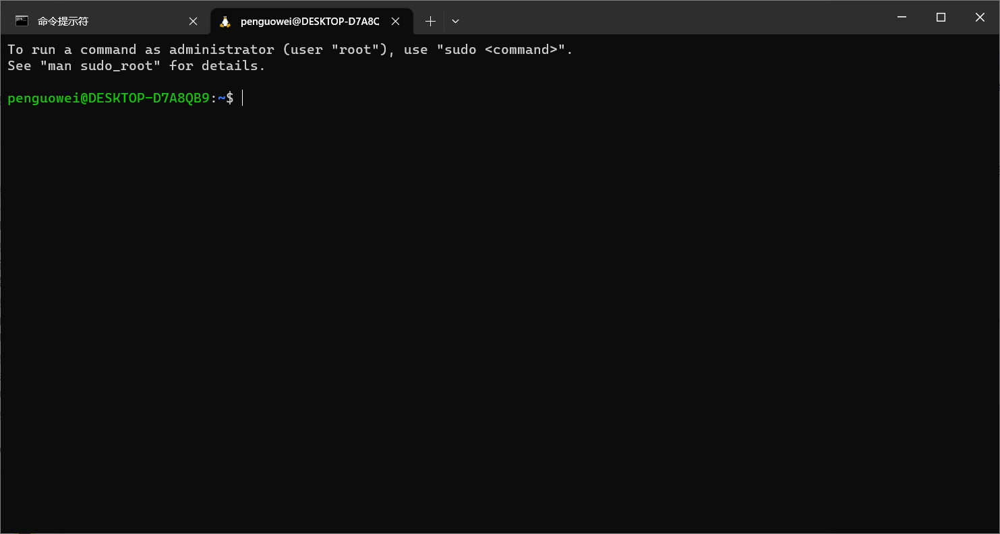
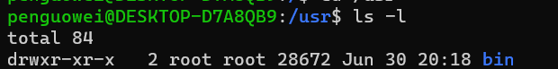

# 一. 什么是wsl？

WSL（Windows Subsystem for Linux）是一个在Windows 10/11上能够运行原生Linux二进制是一个在Windows 10\11上能够运行原生Linux二进制可执行文件（ELF格式）的兼容层

装双系统每次只能用一个系统，在 Ubuntu 下办公不如 Windows 方便，在虚拟机上装 Ubuntu 又没办法共享宿主机的GPU。微软自己推出的WSL，Windows Subsystem for Linux，解决了上述的问题**既能同时使用 Windows 和 Linux，又可以在Linux中使用 Windows 下的GPU**。

# 二. 安装wsl2 Ubuntu20.04

整个安装过程参考博客https://blog.csdn.net/ww_khun/article/details/129410363?spm=1001.2101.3001.6650.1&utm_medium=distribute.pc_relevant.none-task-blog-2%7Edefault%7ECTRLIST%7ERate-1-129410363-blog-107902689.235%5Ev38%5Epc_relevant_sort_base1&depth_1-utm_source=distribute.pc_relevant.none-task-blog-2%7Edefault%7ECTRLIST%7ERate-1-129410363-blog-107902689.235%5Ev38%5Epc_relevant_sort_base1&utm_relevant_index=2

1. ```text
   在windows功能里面勾选实用于linux的windows子系统
   ```

   这个过程可以通过管理员打开powershell输入：

   ```bash
   dism.exe /online /enable-feature /featurename:Microsoft-Windows-Subsystem-Linux /all /norestart
   ```

2. 启用虚拟机平台可选功能

   ```bash
   dism.exe /online /enable-feature /featurename:VirtualMachinePlatform /all /norestart
   ```

   

   设置完成后，重启笔记本

3. 设置wsl版本

   ```bash
   wsl --set-default-version 2
   
   # 更新wsl版本
   wsl --update
   
   # 查看wsl版本
   wsl --version
   ```

   

   

4. 一些常用的wsl命令

   ```bash
   # 列出可安装的 Linux 发行版
   wsl --list --online 或 wsl -l -o
   
   # 列出已安装的 Linux 发行版
   wsl --list --verbose 或 wsl -l -v
   
   # 导出镜像（备份）
   wsl --export <Distribution Name> <FileName>
   
   # 导入镜像（还原）
   wsl --import <Distribution Name> <InstallLocation> <FileName>
   ```

5. 安装Ubuntu20.04

   在Microsoft Store中搜索Linux，下载安装Ubuntu20.04 or 官网下载https://learn.microsoft.com/en-us/windows/wsl/install-manual#downloading-distributions（Microsoft Store默认安装在C盘）

   

   

# 三. Linux基本命令

Linux的命令由3个字段组成

```bash
command -options arguments
```

## 1. bash

```bash
penguowei@DESKTOP-D7A8QB9:~$
```

如果是 “#”，表示该终端拥有超级用户权限——或者是以 root 用户的身份登录，或者是选择的终端仿真器提供超级用户（管理员）权限。

## 2. 粘贴复制

在Linux中不适用ctrl-c，ctrl-v进行粘贴复制，可以使用**鼠标左键选中，鼠标右键粘贴**

## 3. 一些简单的日常命令

```bash
# 显示时间
penguowei@DESKTOP-D7A8QB9:~$ date

# 显示日历
penguowei@DESKTOP-D7A8QB9:~$ cal

# 显示磁盘大小
penguowei@DESKTOP-D7A8QB9:~$ df

# 显示剩余内存大小
penguowei@DESKTOP-D7A8QB9:~$ free

# 退出
penguowei@DESKTOP-D7A8QB9:~$ exit

```

## 4. 文件

### a. 文件目录结构

```bash
# 显示当前工作路径
penguowei@DESKTOP-D7A8QB9:~$ pwd

# 显示当前文件夹下的文件即子文件夹
penguowei@DESKTOP-D7A8QB9:~$ ls

# 更改当前工作目录
# 绝对路径 /home/penguowei
# 相对路径 . 当前目录 .. 父目录
penguowei@DESKTOP-D7A8QB9:~$ cd

```

### b. ls命令

命令名经常会带有一个或多个用来更正命令行为的选项， 更进一步，选项后面会带有一个或多个参数，这些参数是命令作用的对象，以查看文件类型为例：

```bash
penguowei@DESKTOP-D7A8QB9:~$ ls -l
```

| 选项 | 长选项             | 描述                                                         |
| ---- | ------------------ | ------------------------------------------------------------ |
| -a   | --all              | 列出所有文件，甚至包括文件名以圆点开头的默认会被隐藏的隐藏文件。 |
| -d   | --directory        | 通常，如果指定了目录名，ls 命令会列出这个目录中的内容，而不是目录本身。 把这个选项与 -l 选项结合使用，可以看到所指定目录的详细信息，而不是目录中的内容。 |
| -F   | --classify         | 这个选项会在每个所列出的名字后面加上一个指示符。例如，如果名字是 目录名，则会加上一个'/'字符。 |
| -h   | --human-readable   | 当以长格式列出时，以人们可读的格式，而不是以字节数来显示文件的大小。 |
| -l   | 以长格式显示结果。 |                                                              |
| -r   | --reverse          | 以相反的顺序来显示结果。通常，ls 命令的输出结果按照字母升序排列。 |
| -S   |                    | 命令输出结果按照文件大小排序                                 |
| -t   |                    | 按照修改时间排序                                             |



| 字段         | 含义                                                         |
| :----------- | :----------------------------------------------------------- |
| -rw-r--r--   | 对于文件的访问权限。第一个字符指明文件类型。在不同类型之间， 开头的“－”说明是一个普通文件，“d”表明是一个目录。其后三个字符是文件所有者的 访问权限，再其后的三个字符是文件所属组中成员的访问权限，最后三个字符是其他所 有人的访问权限。这个字段的完整含义将在第十章讨论。 |
| 1            | 文件的硬链接数目。参考随后讨论的关于链接的内容。             |
| root         | 文件所属的用户名。                                           |
| root         | 文件所属用户组的名字。                                       |
| 28672        | 以字节数表示的文件大小。                                     |
| Jun 30 20:18 | 上次修改文件的时间和日期。                                   |
| bin          | 文件名。                                                     |

### c. file命令-查看文件信息

```bash
# 显示文件的相关信息
penguowei@DESKTOP-D7A8QB9:~$ file filename 
```


### d. less命令-查看文件

```bash
# 使用less命令查看文件
penguowei@DESKTOP-D7A8QB9:~$ less saber.jpg
```

| 命令               | 行为                                                     |
| :----------------- | :------------------------------------------------------- |
| Page UP or b       | 向上翻滚一页                                             |
| Page Down or space | 向下翻滚一页                                             |
| UP Arrow           | 向上翻滚一行                                             |
| Down Arrow         | 向下翻滚一行                                             |
| G                  | 移动到最后一行                                           |
| 1G or g            | 移动到开头一行                                           |
| /charaters         | 向前查找指定的字符串                                     |
| n                  | 向前查找下一个出现的字符串，这个字符串是之前所指定查找的 |
| h                  | 显示帮助屏幕                                             |
| q                  | 退出 less 程序                                           |

### e. 操作文件

```bash
# mkdir 创建目录，一个命令可同时创建多个目录
penguowei@DESKTOP-D7A8QB9:~$ mkdir dir1 dir2 dir3
```

```bash
# cp 复制一个或多个目标文件或目录，到指定的目录
penguowei@DESKTOP-D7A8QB9:~$ cp saber.jpg saber2.jpg dir1
```

```bash
# mv 移动或者重命名
penguowei@DESKTOP-D7A8QB9:~$ mv saber2.jpg saber3.jpg
```

```bash
# rm 删除文件或目录
penguowei@DESKTOP-D7A8QB9:~$ rm saber3.jpg

# 删除目录
rm -r 
```

```bash
# ln 创建硬链接
penguowei@DESKTOP-D7A8QB9:~$ ln file link

# 创建符号链接
penguowei@DESKTOP-D7A8QB9:~$ ln -s file link
```

### f. 通配符

通配符：

| 通配符        | 意义                               |
| :------------ | :--------------------------------- |
| *             | 匹配任意多个字符（包括零个或一个） |
| ?             | 匹配任意一个字符（不包括零个）     |
| [characters]  | 匹配任意一个属于字符集中的字符     |
| [!characters] | 匹配任意一个不是字符集中的字符     |
| [[:class:]]   | 匹配任意一个属于指定字符类中的字符 |

最常使用的字符类：

| 字符类    | 意义                   |
| :-------- | :--------------------- |
| [:alnum:] | 匹配任意一个字母或数字 |
| [:alpha:] | 匹配任意一个字母       |
| [:digit:] | 匹配任意一个数字       |
| [:lower:] | 匹配任意一个小写字母   |
| [:upper]  | 匹配任意一个大写字母   |

借助通配符，为文件名构建非常复杂的选择标准成为可能。下面是一些类型匹配的范例:

| 模式                 | 匹配对象                                                  |
| :------------------- | :-------------------------------------------------------- |
| *                    | 所有文件                                                  |
| g*                   | 文件名以“g”开头的文件                                     |
| b*.txt               | 以"b"开头，中间有零个或任意多个字符，并以".txt"结尾的文件 |
| Data???              | 以“Data”开头，其后紧接着3个字符的文件                     |
| [abc]*               | 文件名以"a","b",或"c"开头的文件                           |
| BACKUP.[0-9[0-9[0-9] | 以"BACKUP."开头，并紧接着3个数字的文件                    |
| [[:upper:]]*         | 以大写字母开头的文件                                      |
| [![:digit:]]*        | 不以数字开头的文件                                        |
| *[[:lower:]123]      | 文件名以小写字母结尾，或以 “1”，“2”，或 “3” 结尾的文件    |

## 5. 用户权限

在 Unix 安全模型中，一个用户可能拥有文件和目录。当一个用户拥有一个文件或目录时， 用户对这个文件或目录的访问权限拥有控制权。用户，反过来，又属于一个由一个或多个 用户组成的用户组，用户组成员由文件和目录的所有者授予对文件和目录的访问权限。除了 对一个用户组授予权限之外，文件所有者可能会给每个人一些权限，在 Unix 术语中，每个人 是指整个世界。可以用 id 命令，来找到关于你自己身份的信息

```bash
penguowei@DESKTOP-D7A8QB9:~$ id
```

```bash
# 修改用户的权限 前三个字符文件所有者的访问权限  中三个字符文件所有者所在用户组的访问权限   后三个字符其他用户的访问权限

penguowei@DESKTOP-D7A8QB9:~/dir1$ ls -l
total 2120
-rw-r--r-- 1 penguowei penguowei 1570432 Nov  2  2019 saber.jpg
-rw-r--r-- 1 penguowei penguowei  596775 Jun 30 21:31 saber2.jpg
penguowei@DESKTOP-D7A8QB9:~$ chmod
```

| Octal | Binary | File Mode |
| :---- | :----- | :-------- |
| 0     | 000    | ---       |
| 1     | 001    | --x       |
| 2     | 010    | -w-       |
| 3     | 011    | -wx       |
| 4     | 100    | r--       |
| 5     | 101    | r-x       |
| 6     | 110    | rw-       |
| 7     | 111    | rwx       |

| 参数 | 描述                                     |
| ---- | ---------------------------------------- |
| u    | "user"的简写，意思是文件或目录的所有者。 |
| g    | 用户组。                                 |
| o    | "others"的简写，意思是其他所有的人。     |
| a    | "all"的简写，是"u", "g"和“o”三者的联合。 |

```bash
# 如果没有指定字符，则假定使用”all”。执行的操作可能是一个“＋”字符，表示加上一个权限， 一个“－”，表示删掉一个权限，或者是一个“＝”，表示只有指定的权限可用，其它所有的权限被删除。权限由 “r”，“w”，和 “x” 来指定

# 为文件所有者添加可执行权限。
penguowei@DESKTOP-D7A8QB9:~$ chmod u+x	
# 删除文件所有者的可执行权限。
penguowei@DESKTOP-D7A8QB9:~$ chmod u-x	
# 为文件所有者，用户组，和其他所有人添加可执行权限。 等价于 a+x。
penguowei@DESKTOP-D7A8QB9:~$ chmod +x	
penguowei@DESKTOP-D7A8QB9:~$ chmod o-rw	# 除了文件所有者和用户组，删除其他人的读权限和写权限。
penguowei@DESKTOP-D7A8QB9:~$ chmod go=rw	# 给群组的主人和任意文件拥有者的人读写权限。如果群组的主人或全局之前已经有了执行的权限，他们将被移除。
penguowei@DESKTOP-D7A8QB9:~$ chmod u+x,go=rw	#给文件拥有者执行权限并给组和其他人读和执行的权限。多种设定可以用逗号分开。
```

在 Unix 世界中，由于 Unix 是多用户系统，所以在普通用户和管理员之间总是存在很大的 差别。Unix 采取的方法是只有在需要的时候，才授予普通用户超级用户权限。这样，普遍会 用到 su 和 sudo 命令。

几年前，大多数的 Linux 发行版都依赖于 su 命令，来达到目的。su 命令不需要 sudo 命令 所要求的配置，su 命令拥有一个 root 帐号，是 Unix 中的传统。但这会引起问题。所有用户 会企图以 root 用户帐号来操纵系统。事实上，一些用户专门以 root 用户帐号来操作系统， 因为这样做，的确消除了所有那些讨厌的“权限被拒绝”的消息。相比于 Windows 系统安全性而言， 这样做，你就削弱了 Linux 系统安全性能。不是一个好主意。

当引进 Ubuntu 的时候，它的创作者们采取了不同的策略。默认情况下，Ubuntu 不允许用户登录 到 root 帐号（因为不能为 root 帐号设置密码），而是使用 sudo 命令授予普通用户超级用户权限。 **通过 sudo 命令，最初的用户可以拥有超级用户权限，也可以授予随后的用户帐号相似的权力。**

## 6. VI

```bash
# 编辑模式
i

# 返回命令模式
ESC

# 文件写入（保存做的修改）
：W

# 退出
：q  # 保存后退出
：q！ # 不做出修改依旧要退出
：wq # 写入退出两个命令可以合并

# 查找
/char 

```

