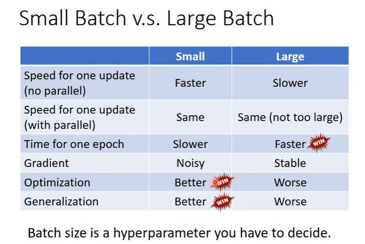
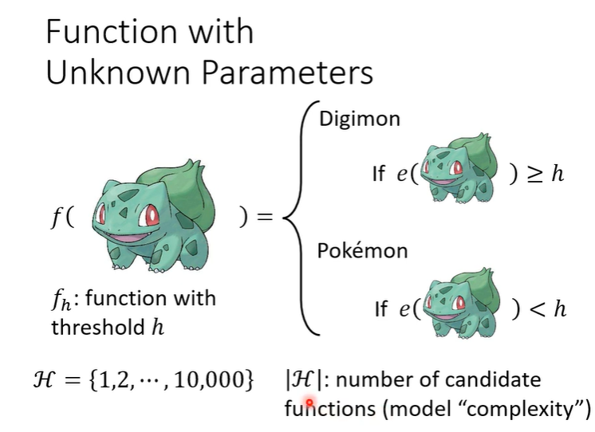
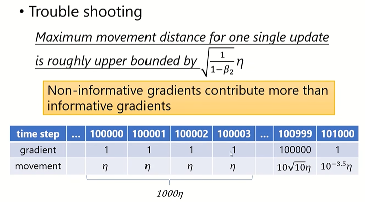
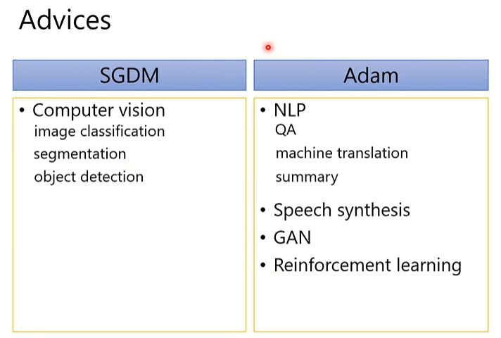

# 0. 回顾

机器学习的训练过程

**第一步：定义一个参数为$\theta$，输入为数据特征$x$的函数$f$，===> 待训练模型**

**第二步：定义一个损失函数，用于评判参数的好坏 ===> $Loss$**

**第三步：利用梯度下降进行优化，寻找一组最佳参数 ===> $Optimization$** 

# 1. 优化机器学习

这是一份优化机器学习模型的**任务攻略**，观察训练模型的**Loss**值：

- 当训练时的损失值偏大：

  - 模型太过简单，尽管通过梯度下降可以找到一组最优参数使得Loss值最小，但由于模型本身的问题，使得不能很好地拟合所求解的问题
  - 模型设置合理，可以通过简单版本的梯度下降。无法找到使得Loss最小的最优参数

  那如何分辨是模型问题，还是优化问题？

  

  在训练数据集上，如果**浅层的网络的Loss值都小于深层网络的Loss值**，那么可以认为模型设置没有问题，而是优化的问题，深层网络无法通过既定的训练次数找到一组最优参数。

- 当训练时的Loss小，而测试时的Loss大 ===> $Overfitting$过拟合

  - Why?

    

  - 如何解决

    - **增加训练数据**

    - **Data augmentation 数据增强**——在原有数据集的基础上进行**增强**，例如在图像识别中可以对数据集进行翻转，截取等

    - 限制模型，**对模型进行限制**，例如我知道一个问题的拟合就是一条二次曲线，那么就可以将函数限制为二次曲线

      

- $Mismatch$

  训练数据分布和测试数据分布不同，即机器根据历史数据只能学到根据经验得到的结果，对于测试数据中的一些特殊分布（例如2.26的数据），不管再怎么优化模型，都无法做到很好的拟合。

  

# 2. Optimization

- 为什么会出现opt失败的现象？

  - 随着训练loss不再下降，但依旧没有达到训练目的

  - 训练一开始，loss就不会下降

    

  是因为**critical point** ===> 微分为0的点

  - local minima

  - saddle point

    

- 如何分辨不同原因导致的critical point？

  将$Loss$函数在给定的一组参数$\theta’$进行泰特展开

  

  当$\theta'$处于critical point时，**微分梯度为0**，那么就根据$\frac{1}{2}(\theta-\theta')^TH(\theta-\theta')$来区分Loss函数此时的种类

  

  

  直接的判断方式就是 ===> **计算Hessian矩阵（海森矩阵）的特征值**

  计算实例：

  

- 如何解决位于鞍点时的问题？

  

  当位于鞍点时，只需要将参数改变**值为海森矩阵的特征向量**，就可以实现Loss的减小

# 3. Batch

- 回顾——使用batch进行训练

  

- **Shuffle**：在每一个epoch中每个batch的数据不一样

  减少数据之间的关联性。

- 为什么要使用Batch进行训练，而不是使用全部的数据进行训练

  考虑一个极端情况

  

  - **时间**

    - 由于GPU并行运算的能力，可以支持大batch-size的数据在计算Loss时所需花费的时间不比一笔笔数据进行计算的时间长（当然，特别大的batch-size时，还是会增加时间的）

    - 由于并行运算的能力，跑完一个epoch的时间，小batch-size会长于大batch-size

      

  - **一个batch一个batch训练（不是看完所有训练数据再更新参数）**带来的参数更新的不稳定性问题，可以带来更好的训练结果

    

    - 其实问题的关键就是，当使用大batch-size进行训练时，可能会带来优化上的问题。

      

      

# 4. Momentum

momentum，动量，在更新参数时加上上一步更新的路程。

$m^i$的计算可以看作是之前梯度的加权和：

​	$m^i=\sum^{k=i-1}_0-\lambda^{i-k-1}\eta g^{k}$ 

**momentum可能解决local minima的问题，由于在更新时，不止根据梯度决定参数的更新**

# 5. Learning rate

大的learning rate导致参数的更新在某一处来回更新，小的learning rate导致参数在某一处更新缓慢；因此一个固定的learning rate并不能很好的完成模型的训练——不同的参数（不同更新时）需要不同的参数：**在梯度值大，更新快速时，需要小的learning rate；在梯度值小，更新缓慢时，需要大的learning rate**

- root mean square ——Adagrad

  

- RMSProp

  

  使用参数$\alpha$决定当前更新与上一步更新的差异程度。

- ！！！！！**Adm**！！！！

  Adam（一种更优化的梯度下降）进行参数更新的方法，就是**momentum+RMSProp**

  

- Learning rate scheduling

  - learning rate decay：学习效率随着时间而减小

    

  - warm up：learning rate 先变大再变小

    在residual network 和 transformer中都使用

    

    **为什么需要warm up？**：

    参数更新：$\theta^{t+1}_i=\theta^t_i-\frac{\eta^t}{\sigma^t_i}g^t_i$，$\sigma$的计算需要一定的数据量进行支撑，因此在参数更新的初始阶段，慢慢给一个数值较大的学习效率，来保证探索。

# 6. Batch Normalization

移山大法，使得Loss函数的曲线能够更加平滑，能够更好地训练——在原视频系列的P48

https://www.bilibili.com/video/BV1Wv411h7kN?p=48&vd_source=5016a4c29f438518f13daf84cad7e560

- 为什么会产生在某些地方$w$的梯度很大，某些地方$w$的梯度很小的情况？

  

  考虑上述这个简单的线性函数，当$x_1$的输入很小，而$x_2$的输入很大时，就会出现$w_1$对$L$的变化影响很小，而$w_2$对$L$的影响很大的情况。

  

  为了解决这个问题，可以**使得不同特征维度的输入$x_1,x_2,...$的值限制在同一个范围**

- *feature normalization*

  

  平均值$m_i=\sum_{k=1}^R x_i^k/R$

  标准差（方差的算数平方根）$\sigma_i=\sqrt\frac{\sum_{n=1}^R(x_i^n-m_i)^2}{R}$

  标准化的结果$\widetilde{x}_i^r=\frac{x_i^r-m_i}{\sigma^i}$

  这样标准化后的结果 ===> 平均值为0：$\sum \widetilde{x}_i^r/R=0$，方差为1
  $$
  \sigma ^2=\frac{\sum(\widetilde x_i^r-0)^2}{R}\\
  =\frac{\sum(\frac{x_i^r-m_i}{\sigma _i})^2}{R}\\
  =\frac{\sum\frac{(x_i^r-m_i)^2}{\frac{\sum (x_i^r-m_i)^2}{R}}}{R}\\
  =\frac{\sum(x_i^r-m_i)^2}{\sum(x_i^r-m_i)^2}=1
  $$
  

  对于一个batch的训练资料，计算这个batch数据的$\mu,\sigma$，进行标准化处理。

  **那么当没有batch数据时？**——当在测试时呢？

  

  在测试时，用$\overline \mu,\overline \sigma$代替。

# 7. Loss——以分类问题为例

**Loss函数的设置也会影响模型的优化问题**——在分类问题中，交叉熵（cross entropy）比平均平方差（MSE）更常用

实例证明——**MSE在Loss较大时的曲线十分平滑，梯度接近0，很难通过梯度下降进行参数更新**

# 8. *overfitting*

-  模型复杂度

  

  模型中含有未知参数的可选择性越多，认为模型越复杂。

- *overfitting*

  在训练集上训练得到的结果*Loss*很小，但是在测试集上得到的*Loss*却很大。

  

  在训练过程中训练得到的参数，在测试集上的结果可能*Loss*很大——在每个数据集上训练的参数对应的*Loss*只能保证在这个数据集上最小，放到其他的数据集上则不一定

  - 为了使得*Loss*在训练数据集和测试数据集上的差别不至于太大，因为我们要找个一个合理的训练数据集，使得在找个训练数据集上的所有参数下的*Loss*都与测试数据集的结果相差不大

    

    

    

    一个training set是个“坏数据集”的概率和**可训练参数的复杂度**和**数据集的样本数**有关。

    综上：为了使得在训练集上训练得到的参数在测试数据集计算得到的*Loss*较小的可能性更大，即发生*over fitting*的概率低的话，应该使得1.数据集的样本数增大，2.模型的复杂度降低

    - 

    - 降低模型的复杂度

      降低模型的复杂度本身就可能导致无法在给定的模型可能上找出一个使得*Loss*很低的模型。即便可以使在训练集上*Loss*和测试集上的*Loss*相差不大。

# 9. 总结-Optimizer

$$
\theta_t : 时间步t时待训练的参数\\ 
\nabla L(\theta_t) : 参数\theta_t的梯度\\
m_{t+1}:动量 momentum
$$
简单地区分on-line learning和off-line learning：

on-line learning在训练的时候只能看见一组训练数据；而off-line learning可以看见所有的训练数据

  

- SGD（stochastic gradient descent）随机梯度下降

  

- SGDM（SGD with momentum）

  

  SGDM可以避免SGD走到$g_t=0$时，stuck住的尴尬现象，导致无法继续往下训练；

  而假如momentum后，尽管当遇见$g_t=0$时，也因为有*momentum*矢量的影响，可以继续往下训练。

- Adagrad

  

  梯度特别大的时候，参数的更新幅度会特别大，这是不愿意看见的一个现象，因为大幅度的更新参数可能会导致错过那个*Loss*很小的点。因此Adagrad对学习率做出了限制，当gradient很大时，分母就很大，学习率低，参数更新地更平缓。

- RMSProp

  

  在Adagrad中，因为是从一开始就进行累加，如果一开始就很大呢，整个更新从一开始就很缓慢。RMSProp做出了改变，考虑地不再是整个过程的gradient的值，而是上一步的gradient值

  **Adagrad和RMSProp都是对学习率做出限制，无法解决当遇到gradient=0情况下的更新问题。**

- Adam

  

  $\hat m_t$：$m_t$是会随着时间步进行累加的，这也导致如果不做处理的话，随着时间步，$m_t$的值会越来越大。$1-\beta_1$对$m_t$做出限制。

  总之，都是使得参数的更新幅度能够相对平滑，而不会出现一下更新剧烈，一下更新很慢。

- 

  Adam可能会找到一个sharp minima导致，在validation的时候差别会更大一点。

  

  由于adapt learning的原因（累加），当出现大部分gradient很小，前期一些意义不大参数更新，在走了很久后，当遇见一个更新意义很明显的时候，参数更新被前期gradient很小的更新过程干扰。

  

  