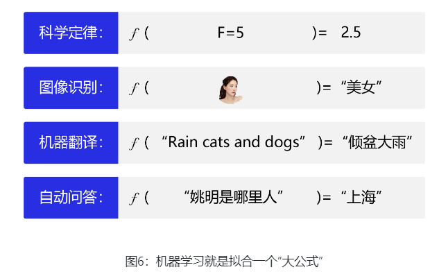
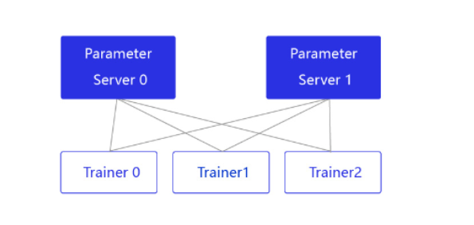
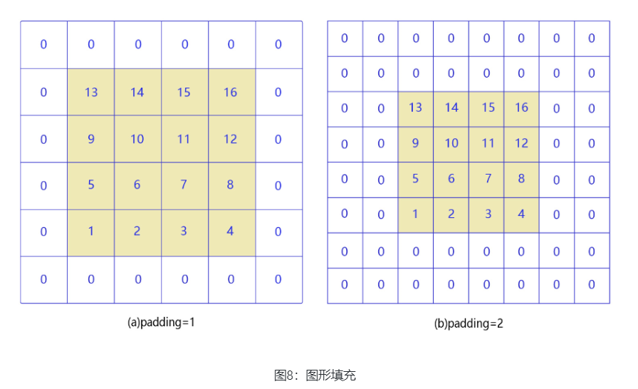
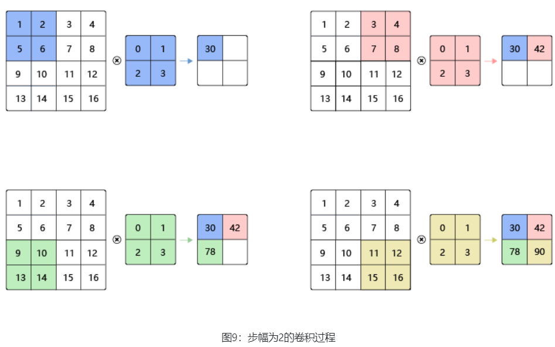

# Ⅰ pytorch

## 1. 什么是pytorch

PyTorch是一个基于python的科学计算包，主要针对两类人群：

- 作为NumPy的替代品，可以利用GPU的性能进行计算
- 作为一个高灵活性、速度快的深度学习平台

## 2. Tensor

`Tensor`是pytorch中一个很重要的概念，类似于`NumPy`的`ndarray`（多维同数据类型的矩阵），但`Tensor`可以在GPU上使用，来加速矩阵运算计算

### `Tensor`的构建：

```python
import torch

# 使用torch生成一个未经初始化的tensor
x = torch.empty(5, 3)
print(x)
tensor([[-5.4113e-10,  7.1466e-43, -5.4113e-10],
        [ 7.1466e-43, -5.4114e-10,  7.1466e-43],
        [-5.4113e-10,  7.1466e-43, -5.4113e-10],
        [ 7.1466e-43, -5.4113e-10,  7.1466e-43],
        [-5.4114e-10,  7.1466e-43, -5.4113e-10]])

# rand（）
# 生成一个随机生成的tensor，生成的数是从【0-1】的均匀分布中进行随机采样得到的
x = torch.rand(5, 3)
print(x)
tensor([[0.1810, 0.2073, 0.9499],
        [0.3135, 0.6506, 0.4924],
        [0.2318, 0.5785, 0.9507],
        [0.2123, 0.0656, 0.2869],
        [0.5626, 0.8462, 0.4684]])

# zeros()
# 生生全0的tensor
x = torch.zeros(5, 3, dtype=torch.long)
print(x)
tensor([[0, 0, 0],
        [0, 0, 0],
        [0, 0, 0],
        [0, 0, 0],
        [0, 0, 0]])
'''
dtype用于限制tensor内数据的数据类型，常见的有torch.float64, torch.long, torch.int32
'''

# 使用自己给的数据生成一个张量
x = torch.tensor([5.5,3])
print(x)
tensor([5.5000, 3.0000])


# 在一个已用tensor的基础上重载一个新的tensor会继承该tensor的属性（size，dtype），除非给出具体的值
# tensor.new_ones()
x = x.new_ones(5, 3,dtype = torch.double)
print(x)
tensor([[1., 1., 1.],
        [1., 1., 1.],
        [1., 1., 1.],
        [1., 1., 1.],
        [1., 1., 1.]], dtype=torch.float64)

# torch.randn_like()
x = torch.randn_like(x, dtype=torch.float)
print(x)
tensor([[-1.2418, -1.0740,  1.2459],
        [-1.1578, -0.3231, -0.3687],
        [-0.5993,  1.4084,  0.0520],
        [-1.4985,  1.8938, -0.2871],
        [-0.3018, -0.7312, -1.2327]])

# torch.ones()
y = torch.ones(5,3,dtype=torch.float)
print(y)
tensor([[1., 1., 1.],
        [1., 1., 1.],
        [1., 1., 1.],
        [1., 1., 1.],
        [1., 1., 1.]])

'''
这里用到了tensor的方法new_ones(),和torch中的randn_like()方法
randn()填充的是【0-1】正态分布中进行随机采样的值
*_like()方法是在已有tensor的基础上赋值生成新的tensor
new_ones()是tensor的方法，它其实对应torch中的ones()方法,实际上，也是调用了torch的ones()方法
'''
```

### `Tensor`的运算：

```python
#size属性
print(x.size())
torch.Size([5, 3])

'''
在PyTorch中，torch.Size是表示张量维度大小的对象，它本质上是一个元组（tuple）,提供了方便的方法来获取和操作张量的维度大小
例如可以通过.length获取tensor一共有多少维，通过下标索引dim1_size = x.size()[1]获得指定维度的大小
'''

# tensor的加法
y = torch.rand(5, 3)
print("x =",x)
print("y =",y)
print("x+y =",x+y)
x = tensor([[-1.2418, -1.0740,  1.2459],
        [-1.1578, -0.3231, -0.3687],
        [-0.5993,  1.4084,  0.0520],
        [-1.4985,  1.8938, -0.2871],
        [-0.3018, -0.7312, -1.2327]])
y = tensor([[1.6534e-01, 9.8917e-01, 9.7854e-02],
        [7.1433e-01, 1.7948e-01, 1.3708e-01],
        [4.2784e-01, 8.9395e-01, 4.7462e-01],
        [8.7529e-04, 3.5924e-01, 2.7113e-01],
        [4.3282e-01, 9.7539e-01, 9.5058e-01]])
x+y = tensor([[-1.0764, -0.0848,  1.3437],
        [-0.4435, -0.1436, -0.2316],
        [-0.1714,  2.3024,  0.5266],
        [-1.4977,  2.2531, -0.0160],
        [ 0.1310,  0.2442, -0.2821]])

# torch.add()
print(torch.add(x,y))
	# 可以指定out参数，用于给add的结果添加参数名，这里的`ret`可以是已经存在的tensor也可以是不存在的
	torch.add(x, y, out = ret)
	print(ret)
tensor([[-1.0764, -0.0848,  1.3437],
        [-0.4435, -0.1436, -0.2316],
        [-0.1714,  2.3024,  0.5266],
        [-1.4977,  2.2531, -0.0160],
        [ 0.1310,  0.2442, -0.2821]])

# add_()
# 原位加法，将x直接加在y上
y.add_(x)
print(y)
tensor([[-1.0764, -0.0848,  1.3437],
        [-0.4435, -0.1436, -0.2316],
        [-0.1714,  2.3024,  0.5266],
        [-1.4977,  2.2531, -0.0160],
        [ 0.1310,  0.2442, -0.2821]])
'''
区别以下几个加法，1.x+y, 2.y.add_(x), 3.y = x+y, 4.y = torch.add(x,y), 5.torch.add(x,y,out = y)
1,3,4在计算时都会先计算得到一个新的张量来存储结果，3，4然后再将新的张量赋值给指定的张量
而2，5再计算时不用创造新的张量，而是将结果直接存储在指定张量中。
'''

# 索引，正如之前提及的tensor继承自numpy，因此，tensor也支持numpy中的索引操作。
'''
x ===> tensor([
		[-1.2418, -1.0740,  1.2459],
        [-1.1578, -0.3231, -0.3687],
        [-0.5993,  1.4084,  0.0520],
        [-1.4985,  1.8938, -0.2871],
        [-0.3018, -0.7312, -1.2327]])
'''
print(x[:,1])
tensor([-1.0740, -0.3231,  1.4084,  1.8938, -0.7312])
#切片操作 ':',单独的':'，表示选择全部，而切片a:b表示从a到b前一个元素，例如这里，输入前3行的第2列的元素
print(x[0:3,1])
tensor([-1.0740, -0.3231,  1.4084])

# view()
# 改变tensor的形状
x = torch.randn(4, 4)
y = x.view(16)
z = x.view(-1, 8)
print(x,x.size())
print(y,y.size())
print(z,z.size())
tensor([[-0.8169, -0.4138,  0.9971, -1.0768],
        [ 0.1345, -0.1707, -1.0573, -0.8969],
        [ 2.9658, -0.4098, -0.9049,  0.5853],
        [-0.1787, -0.7768, -0.5343,  0.7442]]) torch.Size([4, 4])
tensor([-0.8169, -0.4138,  0.9971, -1.0768,  0.1345, -0.1707, -1.0573, -0.8969,
         2.9658, -0.4098, -0.9049,  0.5853, -0.1787, -0.7768, -0.5343,  0.7442]) torch.Size([16])
tensor([[-0.8169, -0.4138,  0.9971, -1.0768,  0.1345, -0.1707, -1.0573, -0.8969],
        [ 2.9658, -0.4098, -0.9049,  0.5853, -0.1787, -0.7768, -0.5343,  0.7442]]) torch.Size([2, 8])
'''
要注意的是，view操作之后的tensor元素个数要和原tensor数据个数相同，4*4 ===> 16*1 or 2*8, 不能转变成3*5，否则会报错
---------------------------------------------------------------------------
RuntimeError                              Traceback (most recent call last)
Cell In[42], line 1
----> 1 k = x.view(3,5)

RuntimeError: shape '[3, 5]' is invalid for input of size 16

当view(-1, )有一个值为-1时，表示根据另外一个输入维度调整这个维度的大小。
'''

# .item()
x = torch.randn(1)
print(x)
print(x.item())
'''
在pytorch中，即使是1*1的tensor也是一个矩阵，要看作一个向量来看待，而不是标量，使用.item()可以获取具体的值，将张量转换为标量
'''
```

### `Tensor`与`Numpy`的转换：

```python
# torch.from_numpy
# 在之前介绍Tensor的构成时，说过可以根据自己的数据生成tensor
a = np.ones(5)
b = torch.from_numpy(a)
print(a)
print(b)
[1. 1. 1. 1. 1.]
tensor([1., 1., 1., 1., 1.], dtype=torch.float64)

# .numpy()
array = b.numpy()
print(array)  
print(type(array))
[1. 1. 1. 1. 1.]
<class 'numpy.ndarray'>

# 对NumPy数组的任何更改都会反映在原始张量上，反之亦然
# 当通过from_numpy(),.numpy(),进行tensor和ndarray的转换后，会返回一个与原始张量共享数据的NumPy数组（共享相同的底层数据）
# b是从a，numpy转换而来的tensor
np.add(a, 1, out=a)
print(a)
print(b)
[2. 2. 2. 2. 2.]
tensor([2., 2., 2., 2., 2.], dtype=torch.float64)

b.add_(b)
print(a)
print(b)
[4. 4. 4. 4. 4.]
tensor([4., 4., 4., 4., 4.], dtype=torch.float64)
'''
共享相同的底层数据——无论改变的是tensor还是numpy，原始的值都要改变
'''
```

### `Tensor`与GPU

```python
# 当GPU可用时,我们可以运行以下代码
# 我们将使用`torch.device`来将tensor移入和移出GPU
if torch.cuda.is_available():
    device = torch.device("cuda")          # a CUDA device object
    y = torch.ones_like(x, device=device)  # 直接在GPU上创建tensor
    x = x.to(device)                       # 或者使用`.to("cuda")`方法
    z = x + y
    print(z)
    print(z.to("cpu", torch.double))       # `.to`也能在移动时改变dtype
```

# Ⅱ PaddlePaddle

## 一、零基础入门深度学习

### 1. 人工智能、机器学习、深度学习的关系


**机器学习（Machine Learning，ML）是目前能比较有效地实现人工智能的一种方式。深度学习（Deep Learning）是机器学习算法中最热门的一个分支**，随着近几年计算机运算能力的加强，逐渐取代了大多数传统的机器学习方法。

#### 1.1 机器学习

机器学习是专门研究计算机怎样模拟或实现人类的学习行为，以获取新的知识或技能，重新组织已有的知识结构，使之不断改善自身的性能 ===> **在已有知识的基础上进行学习和模拟，而获取新的知识或技能，并能够不断地进行优化**

机器学习的实现可以分成两步：`训练`和`预测`，类似于`归纳`和`演绎`：

- **归纳：** 从具体案例中抽象一般规律，机器学习中的“训练”亦是如此。从一定数量的样本（已知模型输入X和模型输出Y）中，学习输出Y与输入X的关系（可以想象成是某种表达式）。
- **演绎：** 从一般规律推导出具体案例的结果，机器学习中的“预测”亦是如此。基于训练得到的Y与X之间的关系，如出现新的输入X，计算出输出Y。通常情况下，如果通过模型计算的输出和真实场景的输出一致，则说明模型是有效的。

**在“机器思考”的过程中确定模型的三个关键要素：`假设`、`评价`、`优化`**，模型假设、评价函数（损失/优化目标）和优化算法是构成模型的三个关键要素

- 模型假设：现实空间中，有大量的Y~X对应关系，因此在假设阶段要先尽可能地通过一些先验知识获取得到Y~X可能的函数关系。
- 损失函数：损失函数定义的好坏，会直接影响到模型的训练效果
- 优化算法：找到最优的一组参数——找到能最准确描述Y与X的关系。

机器思考的过程，其实就是一个复杂大型公式的拟合过程



#### 1.2 深度学习

相比传统的机器学习算法，其实**两者在理论结构上是一致的，即：模型假设、评价函数和优化算法，其根本差别在于假设的复杂度**。

前文提及到机器学习的本质就是要找到一个函数，满足输入X和输出Y的对应关系，只是这个函数会非常复杂。深度学习中使用类比于人类神经元信号传递的一种方式，来拟合这个十分复杂的函数。深度学习（Deep Learning，DL），其实就是很多层的人工神经网络（ANN）。


- `神经元`：神经网络中每个节点称为神经元，由两部分组成：

  - 加权和：将所有输入加权求和。
  - 非线性变换（激活函数）：加权和的结果经过一个非线性函数变换，让神经元计算具备非线性的能力。

- `多层连接`：大量这样的节点按照不同的层次排布，形成多层的结构连接起来，即称为神经网络。

- `前向计算`： 从输入计算输出的过程，顺序从网络前至后。

- `计算图`： 以图形化的方式展现神经网络的计算逻辑又称为计算图，也可以将神经网络的计算图以公式的方式表达：

  $Y=f_3(f_2(f_1(w_1x_1+w_2x_2+ \cdots+b)))$

### 2. 构建神经网络模型——以房价预测为例

对于预测问题，可以根据预测输出的类型是连续的实数值，还是离散的标签，区分为回归任务和分类任务。房价是一个连续值，所以房价预测显然是一个回归任务


#### 2.1 线性回归模型

- `模型假设`：房价的预测受$M$个因素的影响，假设房价与各因素之间是线性关系：

$$
y=\sum_{j=1}^M x_jw_j+b
$$


- `损失函数`：使用均方差（Mean Square Error）来作为损失函数衡量预测值和真实值之间的关系
  $$
  MSE=\frac{1}{n}\sum_{i=1}^n (\hat{Y_i}-Y_i)^2
  $$

#### 2.2 使用python实现


1. 数据处理

   数据处理包含五个部分：

   - `数据读入`：$np.fromfile()$ 
   - `数据形状变换`：刚刚读入的数据为一个一维的向量，需要使用$data.reshape()$进行维度的改变
   - `数据集划分`：使用切分$:$，按照比例将数据集划分为测试集和训练集
   - `数据归一化处理`：**使所有的特征向量能够保持在同一个数据范围（这样可以使得参数更加反应该特征值对于输出的重要性，而不需考虑特征值的数值大小）**
   - 最后封装为`load_data`函数。

   数据预处理后，才能被模型调用

   ```python
   def load_data():
       # 从文件导入数据
       datafile = './data/houseprice.data'
       data = np.fromfile(datafile, sep=' ')
   
       # 每条数据包括14项，其中前面13项是影响因素，第14项是相应的房屋价格中位数
       feature_names = [ 'CRIM', 'ZN', 'INDUS', 'CHAS', 'NOX', 'RM', 'AGE', \
                         'DIS', 'RAD', 'TAX', 'PTRATIO', 'B', 'LSTAT', 'MEDV' ]
       feature_num = len(feature_names)
   
       # 将原始数据进行Reshape，变成[N, 14]这样的形状
       data = data.reshape([data.shape[0] // feature_num, feature_num])
   
       # 将原数据集拆分成训练集和测试集
       # 这里使用80%的数据做训练，20%的数据做测试
       # 测试集和训练集必须是没有交集的
       ratio = 0.8
       offset = int(data.shape[0] * ratio)
       training_data = data[:offset]
   
       # 计算训练集的最大值，最小值
       maximums, minimums = training_data.max(axis=0), training_data.min(axis=0)
   
       # 对数据进行归一化处理
       for i in range(feature_num):
           data[:, i] = (data[:, i] - minimums[i]) / (maximums[i] - minimums[i])
   
       # 训练集和测试集的划分比例
       training_data = data[:offset]
       test_data = data[offset:]
       return training_data, test_data
   ```

2. 模型设置

   ```python
   class Network(object):
       def __init__(self, num_of_weights):
           # 随机产生w的初始值
           # 为了保持程序每次运行结果的一致性，此处设置固定的随机数种子
           #np.random.seed(0)
           self.w = np.random.randn(num_of_weights, 1)
           self.b = 0.
       
       # 定义神经网络层
       def forward(self, x):
           z = np.dot(x, self.w) + self.b
           return z
       
       # 定义损失函数
       def loss(self, z, y):
           error = z - y
           num_samples = error.shape[0]
           cost = error * error
           cost = np.sum(cost) / num_samples
           return cost
   ```

3. 训练配置

   ```python
       # 定义梯度的计算公式
       def gradient(self, x, y):
           z = self.forward(x)
           N = x.shape[0]
           gradient_w = 1. / N * np.sum((z-y) * x, axis=0)
           gradient_w = gradient_w[:, np.newaxis]
           gradient_b = 1. / N * np.sum(z-y)
           return gradient_w, gradient_b
       
       # 定义参数的更新
       def update(self, gradient_w, gradient_b, eta = 0.01):
           self.w = self.w - eta * gradient_w
           self.b = self.b - eta * gradient_b
   ```

4. 训练过程（使用随机梯度下降SGD方法）

   ```python
       def train(self, training_data, num_epochs, batch_size=10, eta=0.01):
               n = len(training_data)
               losses = []
               for epoch_id in range(num_epochs):
                   # 在每轮迭代开始之前，将训练数据的顺序随机打乱
                   # 然后再按每次取batch_size条数据的方式取出
                   np.random.shuffle(training_data)
                   # 将训练数据进行拆分，每个mini_batch包含batch_size条的数据
                   mini_batches = [training_data[k:k+batch_size] for k in range(0, n, batch_size)]
                   for iter_id, mini_batch in enumerate(mini_batches):
                       #print(self.w.shape)
                       #print(self.b)
                       x = mini_batch[:, :-1]
                       y = mini_batch[:, -1:]
                       a = self.forward(x)
                       loss = self.loss(a, y)
                       gradient_w, gradient_b = self.gradient(x, y)
                       self.update(gradient_w, gradient_b, eta)
                       losses.append(loss)
                       print('Epoch {:3d} / iter {:3d}, loss = {:.4f}'.
                                        format(epoch_id, iter_id, loss))
   
               return losses
   # 获取数据
   train_data, test_data = load_data()
   
   # 创建网络
   net = Network(13)
   # 启动训练
   losses = net.train(train_data, num_epochs=50, batch_size=100, eta=0.1)
   
   # 画出损失函数的变化趋势
   plot_x = np.arange(len(losses))
   plot_y = np.array(losses)
   plt.plot(plot_x, plot_y)
   plt.show()
   ```

5. 模型保存

   ```python
   np.save('w.npy', net.w)
   np.save('b.npy', net.b)
   ```

### 3. 飞桨安装


刚才通过使用python中的numpy进行一个简单神经网络的搭建，不难发现对于一些步骤，原生的代码书写 较为复杂，例如优化器的编写，损失函数的定义，梯度的求解等，而飞桨、pytorch、tensorflow等平台都通过封装原子函数来辅助开发人员进行神经网路的搭建。

- paddlepaddle安装

  https://www.paddlepaddle.org.cn/install/quick?docurl=/documentation/docs/zh/install/pip/linux-pip.html

  ```bash
  python -m pip install paddlepaddle-gpu==2.4.2.post117 -f https://www.paddlepaddle.org.cn/whl/linux/mkl/avx/stable.html
  ```

### 4. 使用paddle搭建线性回归神经网络模型

```python
def load_data():
    # 从文件导入数据
    datafile = '../data/houseprice.data'
    data = np.fromfile(datafile, sep=' ', dtype=np.float32)

    # 每条数据包括14项，其中前面13项是影响因素，第14项是相应的房屋价格中位数
    feature_names = [ 'CRIM', 'ZN', 'INDUS', 'CHAS', 'NOX', 'RM', 'AGE', \
                      'DIS', 'RAD', 'TAX', 'PTRATIO', 'B', 'LSTAT', 'MEDV' ]
    feature_num = len(feature_names)

    # 将原始数据进行Reshape，变成[N, 14]这样的形状
    data = data.reshape([data.shape[0] // feature_num, feature_num])

    # 将原数据集拆分成训练集和测试集
    # 这里使用80%的数据做训练，20%的数据做测试
    # 测试集和训练集必须是没有交集的
    ratio = 0.8
    offset = int(data.shape[0] * ratio)

    # 训练集和测试集的划分比例
    training_data = data[:offset]
    test_data = data[offset:]

    # 计算train数据集的最大值，最小值
    maximums, minimums = training_data.max(axis=0), training_data.min(axis=0)
    
    # 记录数据的归一化参数，在预测时对数据做归一化
    global max_values
    global min_values
   
    max_values = maximums
    min_values = minimums
    
    # 对数据进行归一化处理
    for i in range(feature_num):
        data[:, i] = (data[:, i] - min_values[i]) / (maximums[i] - minimums[i])

    return training_data, test_data

class Model(paddle.nn.Layer):

    # self代表类的实例自身
    def __init__(self):
        # 初始化父类中的一些参数
        super(Model, self).__init__()
        
        # 定义一层全连接层，输入维度是13，输出维度是1
        self.fc = paddle.nn.Linear(in_features=13, out_features=1)
    
    # 网络的前向计算
    def forward(self, inputs):
        out = self.fc(inputs)
        return out
    
training_data, test_data = load_data()
print(training_data.shape)
print(training_data[0,:])
# 声明定义好的线性回归模型
model = Model()
# 开启模型训练模式
model.train()
# 加载数据
training_data, test_data = load_data()
# 定义优化算法，使用随机梯度下降SGD
# 学习率设置为0.01
opt = paddle.optimizer.SGD(learning_rate=0.01, parameters=model.parameters())

EPOCH_NUM = 10   # 设置外层循环次数
BATCH_SIZE = 10  # 设置batch大小

# 定义外层循环
for epoch_id in range(EPOCH_NUM):
    # 在每轮迭代开始之前，将训练数据的顺序随机的打乱
    np.random.shuffle(training_data)
    
    # 将训练数据进行拆分，每个batch包含10条数据
    mini_batches = [training_data[k:k+BATCH_SIZE] for k in range(0, len(training_data), BATCH_SIZE)]
    
    # 定义内层循环
    for iter_id, mini_batch in enumerate(mini_batches):
        x = np.array(mini_batch[:, :-1]) # 获得当前批次训练数据
        y = np.array(mini_batch[:, -1:]) # 获得当前批次训练标签（真实房价）
        # 将numpy数据转为飞桨动态图tensor的格式
        house_features = paddle.to_tensor(x)
        prices = paddle.to_tensor(y)
        
        # 前向计算
        predicts = model(house_features)
        
        # 计算损失
        loss = paddle.nn.functional.square_error_cost(predicts, label=prices)
        avg_loss = paddle.mean(loss)
        if iter_id%20==0:
            print("epoch: {}, iter: {}, loss is: {}".format(epoch_id, iter_id, avg_loss.numpy()))
        
        # 反向传播，计算每层参数的梯度值
        avg_loss.backward()
        # 更新参数，根据设置好的学习率迭代一步
        opt.step()
        # 清空梯度变量，以备下一轮计算
        opt.clear_grad()
        
paddle.save(model.state_dict(), 'LR_model.pdparams')
print("模型保存成功，模型参数保存在LR_model.pdparams中")

def load_one_example():
    # 从上边已加载的测试集中，随机选择一条作为测试数据
    idx = np.random.randint(0, test_data.shape[0])
    idx = -10
    one_data, label = test_data[idx, :-1], test_data[idx, -1]
    # 修改该条数据shape为[1,13]
    one_data =  one_data.reshape([1,-1])

    return one_data, label

# 参数为保存模型参数的文件地址
model_dict = paddle.load('LR_model.pdparams')
model.load_dict(model_dict)
model.eval()

# 参数为数据集的文件地址
one_data, label = load_one_example()
# 将数据转为动态图的variable格式 
one_data = paddle.to_tensor(one_data)
predict = model(one_data)

# 对结果做反归一化处理
predict = predict * (max_values[-1] - min_values[-1]) + min_values[-1]
# 对label数据做反归一化处理
label = label * (max_values[-1] - min_values[-1]) + min_values[-1]

print("Inference result is {}, the corresponding label is {}".format(predict.numpy(), label))
```

## 二、深度学习——以手写数字识别为例

### 1. 简单线性模型

- 任务输入：MNIST数字集，一系列手写数字图片，其中每张图片都是28x28的像素矩阵。
- 任务输出：经过了大小归一化和居中处理，输出对应的0~9的数字标签。

```python
# 使用paddle携带的MNIST数据集
train_dataset = paddle.vision.datasets.MNIST(mode='train')

train_loader = paddle.io.DataLoader(paddle.vision.datasets.MNIST(mode='train'), 
                                        batch_size=16, 
# 定义mnist数据识别网络结构，同房价预测网络
class MNIST(paddle.nn.Layer):
    def __init__(self):
        super(MNIST, self).__init__()
        
        # 定义一层全连接层，输出维度是1
        self.fc = paddle.nn.Linear(in_features=784, out_features=1)
        
    # 定义网络结构的前向计算过程
    def forward(self, inputs):
        outputs = self.fc(inputs)
        return outputs                                        shuffle=True)

def train(model):
    # 启动训练模式
    model.train()
    # 加载训练集 batch_size 设为 16
    train_loader = paddle.io.DataLoader(paddle.vision.datasets.MNIST(mode='train'), 
                                        batch_size=16, 
                                        shuffle=True)
    # 定义优化器，使用随机梯度下降SGD优化器，学习率设置为0.001
    opt = paddle.optimizer.SGD(learning_rate=0.001, parameters=model.parameters())
    EPOCH_NUM = 10
    for epoch in range(EPOCH_NUM):
        for batch_id, data in enumerate(train_loader()):
            images = norm_img(data[0]).astype('float32')
            labels = data[1].astype('float32')
            
            #前向计算的过程
            predicts = model(images)
            
            # 计算损失
            loss = F.square_error_cost(predicts, labels)
            avg_loss = paddle.mean(loss)
            
            #每训练了1000批次的数据，打印下当前Loss的情况
            if batch_id % 1000 == 0:
                print("epoch_id: {}, batch_id: {}, loss is: {}".format(epoch, batch_id, avg_loss.numpy()))
            
            #后向传播，更新参数的过程
            avg_loss.backward()
            opt.step()
            opt.clear_grad()
            
train(model)
paddle.save(model.state_dict(), './mnist.pdparams')
```

### 2. 优化数据预处理

在工业实践中，我们面临的任务和数据环境千差万别，通常需要自己编写适合当前任务的数据处理程序，一般涉及如下五个环节：

- 读入数据
- 划分数据集
- 生成批次数据
- 训练样本集乱序
- 校验数据有效性

使用paddle定义的Dataset和Dateloader

```python
class MnistDataset(paddle.io.Dataset):
    def __init__(self, mode):
        datafile = './work/mnist.json.gz'
        data = json.load(gzip.open(datafile))
        # 读取到的数据区分训练集，验证集，测试集
        train_set, val_set, eval_set = data
        if mode=='train':
            # 获得训练数据集
            imgs, labels = train_set[0], train_set[1]
        elif mode=='valid':
            # 获得验证数据集
            imgs, labels = val_set[0], val_set[1]
        elif mode=='eval':
            # 获得测试数据集
            imgs, labels = eval_set[0], eval_set[1]
        else:
            raise Exception("mode can only be one of ['train', 'valid', 'eval']")
        
        # 校验数据
        imgs_length = len(imgs)
        assert len(imgs) == len(labels), \
            "length of train_imgs({}) should be the same as train_labels({})".format(len(imgs), len(labels))
        
        self.imgs = imgs
        self.labels = labels

    def __getitem__(self, idx):
        img = np.array(self.imgs[idx]).astype('float32')
        label = np.array(self.labels[idx]).astype('float32')
        
        return img, label

    def __len__(self):
        return len(self.imgs)
    

# 声明数据加载函数，使用MnistDataset数据集
train_dataset = MnistDataset(mode='train')
# 使用paddle.io.DataLoader 定义DataLoader对象用于加载Python生成器产生的数据，
# DataLoader 返回的是一个批次数据迭代器，并且是异步的；
data_loader = paddle.io.DataLoader(train_dataset, batch_size=100, shuffle=True)
# 迭代的读取数据并打印数据的形状
for i, data in enumerate(data_loader()):
    images, labels = data
    
```

### 3. 更复杂的网络结构

```python
# 两层全连接层

import paddle.nn.functional as F
from paddle.nn import Linear

# 定义多层全连接神经网络
class MNIST(paddle.nn.Layer):
    def __init__(self):
        super(MNIST, self).__init__()
        # 定义两层全连接隐含层，输出维度是10，当前设定隐含节点数为10，可根据任务调整
        self.fc1 = Linear(in_features=784, out_features=128)
        self.fc2 = Linear(in_features=128, out_features=128)
        # 定义一层全连接输出层，输出维度是1
        self.fc3 = Linear(in_features=128, out_features=1)
    
    # 定义网络的前向计算，隐含层激活函数为sigmoid，输出层不使用激活函数
    def forward(self, inputs):
        # inputs = paddle.reshape(inputs, [inputs.shape[0], 784])
        outputs1 = self.fc1(inputs)
        outputs1 = F.sigmoid(outputs1)
        outputs2 = self.fc2(outputs1)
        outputs2 = F.sigmoid(outputs2)
        outputs_final = self.fc3(outputs2)
        return outputs_final
```


```python
# 简单的卷积层网络

# 定义 SimpleNet 网络结构
import paddle
from paddle.nn import Conv2D, MaxPool2D, Linear
import paddle.nn.functional as F
# 多层卷积神经网络实现
class MNIST(paddle.nn.Layer):
     def __init__(self):
         super(MNIST, self).__init__()
         
         # 定义卷积层，输出特征通道out_channels设置为20，卷积核的大小kernel_size为5，卷积步长stride=1，padding=2
         self.conv1 = Conv2D(in_channels=1, out_channels=20, kernel_size=5, stride=1, padding=2)
         # 定义池化层，池化核的大小kernel_size为2，池化步长为2
         self.max_pool1 = MaxPool2D(kernel_size=2, stride=2)
         # 定义卷积层，输出特征通道out_channels设置为20，卷积核的大小kernel_size为5，卷积步长stride=1，padding=2
         self.conv2 = Conv2D(in_channels=20, out_channels=20, kernel_size=5, stride=1, padding=2)
         # 定义池化层，池化核的大小kernel_size为2，池化步长为2
         self.max_pool2 = MaxPool2D(kernel_size=2, stride=2)
         # 定义一层全连接层，输出维度是1
         self.fc = Linear(in_features=980, out_features=1)
         
    # 定义网络前向计算过程，卷积后紧接着使用池化层，最后使用全连接层计算最终输出
    # 卷积层激活函数使用Relu，全连接层不使用激活函数
     def forward(self, inputs):
         x = self.conv1(inputs)
         x = F.relu(x)
         x = self.max_pool1(x)
         x = self.conv2(x)
         x = F.relu(x)
         x = self.max_pool2(x)
         x = paddle.reshape(x, [x.shape[0], -1])
         x = self.fc(x)
         return x
```

### 4. 优化损失函数

```python
# 在分类问题中，引入SoftMax，使用交叉熵作为Loss

# 定义一层全连接层，输出维度是10
         self.fc = Linear(in_features=980, out_features=10)
#计算损失，使用交叉熵损失函数，取一个批次样本损失的平均值
            loss = F.cross_entropy(predicts, labels)
            avg_loss = paddle.mean(loss)
```

### 5. 改进优化算法

- **[SGD：](https://www.paddlepaddle.org.cn/documentation/docs/zh/2.0-beta/api/paddle/optimizer/SGD_cn.html)** 随机梯度下降算法，每次训练少量数据，抽样偏差导致的参数收敛过程中震荡。
- **[Momentum：](https://www.paddlepaddle.org.cn/documentation/docs/zh/2.0-beta/api/paddle/optimizer/Momentum_cn.html)** 引入物理“动量”的概念，累积速度，减少震荡，使参数更新的方向更稳定。

每个批次的数据含有抽样误差，导致梯度更新的方向波动较大。如果我们引入物理动量的概念，给梯度下降的过程加入一定的“惯性”累积，就可以减少更新路径上的震荡，即每次更新的梯度由“历史多次梯度的累积方向”和“当次梯度”加权相加得到。历史多次梯度的累积方向往往是从全局视角更正确的方向，这与“惯性”的物理概念很像，也是为何其起名为“Momentum”的原因。类似不同品牌和材质的篮球有一定的重量差别，街头篮球队中的投手（擅长中远距离投篮）喜欢稍重篮球的比例较高。一个很重要的原因是，重的篮球惯性大，更不容易受到手势的小幅变形或风吹的影响。

- **[AdaGrad：](https://www.paddlepaddle.org.cn/documentation/docs/zh/2.0-beta/api/paddle/optimizer/AdagradOptimizer_cn.html)** 根据不同参数距离最优解的远近，动态调整学习率。学习率逐渐下降，依据各参数变化大小调整学习率。

通过调整学习率的实验可以发现：当某个参数的现值距离最优解较远时（表现为梯度的绝对值较大），我们期望参数更新的步长大一些，以便更快收敛到最优解。当某个参数的现值距离最优解较近时（表现为梯度的绝对值较小），我们期望参数的更新步长小一些，以便更精细的逼近最优解。类似于打高尔夫球，专业运动员第一杆开球时，通常会大力打一个远球，让球尽量落在洞口附近。当第二杆面对离洞口较近的球时，他会更轻柔而细致的推杆，避免将球打飞。与此类似，参数更新的步长应该随着优化过程逐渐减少，减少的程度与当前梯度的大小有关。根据这个思想编写的优化算法称为“AdaGrad”，Ada是Adaptive的缩写，表示“适应环境而变化”的意思。[RMSProp](https://www.paddlepaddle.org.cn/documentation/docs/zh/api_cn/optimizer_cn/RMSPropOptimizer_cn.html#rmspropoptimizer)是在AdaGrad基础上的改进，学习率随着梯度变化而适应，解决AdaGrad学习率急剧下降的问题。

- **[Adam：](https://www.paddlepaddle.org.cn/documentation/docs/zh/2.0-beta/api/paddle/optimizer/Adam_cn.html)** 由于动量和自适应学习率两个优化思路是正交的，因此可以将两个思路结合起来，这就是当前广泛应用的算法。

```python
 #四种优化算法的设置方案，可以逐一尝试效果
    opt = paddle.optimizer.SGD(learning_rate=0.01, parameters=model.parameters())
    # opt = paddle.optimizer.Momentum(learning_rate=0.01, momentum=0.9, parameters=model.parameters())
    # opt = paddle.optimizer.Adagrad(learning_rate=0.01, parameters=model.parameters())
    # opt = paddle.optimizer.Adam(learning_rate=0.01, parameters=model.parameters())
```

### 6. 运算设备配置

#### 6.1 GPU运算

```python

# 通过paddle.device.set_device API，设置在GPU上训练还是CPU上训练。

paddle.device.set_device (device)

 # 开启GPU
    use_gpu = True
    paddle.device.set_device('gpu:0') if use_gpu else paddle.device.set_device('cpu')
```

#### 6.2 分布式运算

- 模型并行

`模型并行`是将一个网络模型拆分为多份，拆分后的模型分到多个设备上（GPU）训练，**每个设备的训练数据是相同的**。模型并行的实现模式可以节省内存，但是应用较为受限

模型并行的方式一般适用于如下两个场景：

1. **模型架构过大：** 完整的模型无法放入单个GPU。如2012年ImageNet大赛的冠军模型AlexNet是模型并行的典型案例，由于当时GPU内存较小，单个GPU不足以承担AlexNet，因此研究者将AlexNet拆分为两部分放到两个GPU上并行训练。
2. **网络模型的结构设计相对独立：** 当网络模型的设计结构可以并行化时，采用模型并行的方式。如在计算机视觉目标检测任务中，一些模型（如YOLO9000）的边界框回归和类别预测是独立的，可以将独立的部分放到不同的设备节点上完成分布式训练。

- 数据并行

`数据并行`与模型并行不同，数据并行每次读取多份数据，**读取到的数据输入给多个设备（GPU）上的模型**，每个设备上的模型是完全相同的，飞桨采用的就是这种方式。

*当前GPU硬件技术快速发展，深度学习使用的主流GPU的内存已经足以满足大多数的网络模型需求，所以大多数情况下使用数据并行的方式。*

值得注意的是，每个设备的模型是完全相同的，但是输入数据不同，因此**每个设备的模型计算出的梯度是不同的**。如果每个设备的梯度只更新当前设备的模型，就会导致下次训练时，每个模型的参数都不相同。因此我们还需要一个**梯度同步机制**，保证每个设备的梯度是完全相同的。

梯度同步有两种方式：`PRC通信方式`和`NCCL2通信方式`（Nvidia Collective multi-GPU Communication Library）。

- PRC通信

  PRC通信方式通常用于CPU分布式训练，它有两个节点：参数服务器Parameter server和训练节点Trainer

  parameter server收集来自每个设备的梯度更新信息，并计算出一个全局的梯度更新。Trainer用于训练，每个Trainer上的程序相同，但数据不同。当Parameter server收到来自Trainer的梯度更新请求时，统一更新模型的梯度。

  

- NCCL2通信

  使用NCCL2（Collective通信方式）进行分布式训练，不需要启动Parameter server进程，每个Trainer进程保存一份完整的模型参数，在完成梯度计算之后通过Trainer之间的相互通信，Reduce梯度数据到所有节点的所有设备，然后每个节点在各自完成参数更新。

  

### 7. 训练调试与优化

1. 计算模型的分类准确率

   ```python
   # class.paddle.metric.Accuracy
   # input x 是预测分类的结果
   
   if label is not None:
                acc = paddle.metric.accuracy(input=x, label=label)
                return x, acc
   ```

2. 检查模型的训练过程

   在网络定义的Forward函数中，可以打印每一层输入输出的尺寸，以及每层网络的参数

   ```python
   print("\n########## print network layer's superparams ##############")
   print("conv1-- kernel_size:{}, padding:{}, stride:{}".format(self.conv1.weight.shape,\ self.conv1._padding, self.conv1._stride))
   ```

3. 使用校验集or测试集

   为了验证模型的有效性，通常将样本集合分成三份，`训练集`、`校验集`和`测试集`。

   - **训练集** ：用于训练模型的参数，即训练过程中主要完成的工作。
   - **校验集** ：用于对模型超参数的选择，比如网络结构的调整、正则化项权重的选择等。
   - **测试集** ：用于模拟模型在应用后的真实效果。因为测试集没有参与任何模型优化或参数训练的工作，所以它对模型来说是完全未知的样本。**在不以校验数据优化网络结构或模型超参数时，校验数据和测试数据的效果是类似的**，均更真实的反映模型效果。

4. 正则化

   可能过拟合的原因：

   - 情况1：训练数据存在噪音，导致模型学到了噪音，而不是真实规律。

   - 情况2：使用强大模型（表示空间大）的同时训练数据太少，导致在训练数据上表现良好的候选假设太多，锁定了一个“虚假正确”的假设。

   为了防止模型过拟合，在没有扩充样本量的可能下，只能降低模型的复杂度，可以通过限制参数的数量或可能取值（参数值尽量小）实现。

   具体来说，在模型的优化目标（损失）中人为加入对参数规模的惩罚项。当参数越多或取值越大时，该惩罚项就越大。通过调整惩罚项的权重系数，可以使模型在“尽量减少训练损失”和“保持模型的泛化能力”之间取得平衡。泛化能力表示模型在没有见过的样本上依然有效。正则化项的存在，增加了模型在训练集上的损失

   ```python
   # weight_decay=paddle.regularizer.L2Decay(coeff=1e-5)
   
   opt = paddle.optimizer.Adam(learning_rate=0.01, weight_decay=paddle.regularizer.L2Decay(coeff=1e-5), parameters=model.parameters())
   ```

5. 可视化

   - **Matplotlib库**：Matplotlib库是Python中使用的最多的2D图形绘图库，它有一套完全仿照MATLAB的函数形式的绘图接口，使用轻量级的PLT库（Matplotlib）作图是非常简单的。

   - **VisualDL**：如果期望使用更加专业的作图工具，可以尝试VisualDL，飞桨可视化分析工具。VisualDL能够有效地展示飞桨在运行过程中的计算图、各种指标变化趋势和数据信息。

     ```python
     iters=[]
     losses=[]
     for epoch_id in range(EPOCH_NUM):
     	for batch_id, data in enumerate(train_loader()):
             images, labels = data
             predicts, acc = model(images, labels)
             loss = F.cross_entropy(predicts, label = labels.astype('int64'))
             avg_loss = paddle.mean(loss)
             # 累计迭代次数和对应的loss
        	iters.append(batch_id + epoch_id*len(list(train_loader()))
     	losses.append(avg_loss)
     # 使用matplot
     plt.xlabel("iter", fontsize=14)
     plt.ylabel("loss", fontsize=14)
     plt.plot(iters, losses,color='red',label='train loss') 
                     
     ```

     ```python
     # 类似于tensorboard做的visualDL
     
     from visualdl import LogWriter
     log_writer = LogWriter("./log")
     
     log_writer.add_scalar(tag = 'acc', step = iter, value = avg_acc.numpy())
     log_writer.add_scalar(tag = 'loss', step = iter, value = avg_loss.numpy())
     iter = iter + 100
     
     $ visualdl --logdir ./log --port 8080
     
     # 安装VisualDL
     pip install --upgrade --pre visualdl
     ```

6. 模型加载与恢复训练

   飞桨支持从上一次保存状态开始训练，只要我们随时保存训练过程中的模型状态，就不用从初始状态重新训练

   ```python
   # 动态的学习率
   '''
   learning_rate (float)：初始学习率，数据类型为Python float。
   decay_steps (int)：进行衰减的步长，这个决定了衰减周期。
   end_lr (float，可选）：最小的最终学习率，默认值为0.0001。
   power (float，可选)：多项式的幂，默认值为1.0。
   last_epoch (int，可选)：上一轮的轮数，重启训练时设置为上一轮的epoch数。默认值为-1，则为初始学习率。
   verbose (bool，可选)：如果是 True，则在每一轮更新时在标准输出stdout输出一条信息，默认值为False。
   cycle (bool，可选)：学习率下降后是否重新上升。若为True，则学习率衰减到最低学习率值时会重新上升。若为False，则学习率单调递减。默认值为False。
   '''
   paddle.optimizer.lr.PolynomialDecay (learningrate, decaysteps, endlr=0.0001, power=1.0, cycle=False, lastepoch=- 1, verbose=False)
   
   lr = paddle.optimizer.lr.PolynomialDecay(learning_rate=0.01, decay_steps=total_steps, end_lr=0.001)
   opt = paddle.optimizer.Momentum(learning_rate=lr, parameters=model.parameters())
   ```

   **模型恢复训练，需要重新组网，所以我们需要重启AIStudio，运行`MnistDataset`数据读取和`MNIST`网络定义、`Trainer`部分代码，再执行模型恢复代码**

   ```python
   # 保存时，保存优化器和参数
   paddle.save(opt.state_dict(), 'model.pdopt')
   paddle.save(model.state_dict(), 'model.pdparams')
   
   # 恢复时
   model_dict = paddle.load("model.pdparams")
   opt_dict = paddle.load("model.pdopt")
   
   model.set_state_dict(model_dict)
   opt.set_state_dict(opt_dict)
   ```

## 三、计算机视觉

**卷积神经网络**：卷积神经网络（Convolutional Neural Networks, CNN）是计算机视觉技术最经典的模型结构。卷积神经网络的常用模块包括：卷积、池化、激活函数、批归一化、丢弃法等。

- **图像分类**：图像分类算法的经典模型结构，包括：LeNet、AlexNet、VGG、GoogLeNet、ResNet
- **目标检测**：目标检测YOLOv3算法。


计算机视觉技术的常见分类有：

- 图像分类，image classification，用于识别图片中物体的类别
- 目标检测，object localization，用于检测图像中每个物体的类别，并准确标出它们的位置
- 图像语义分割，semantic segmentation，用于标出图像中每个像素点所属的类别，属于同一类别的像素点用一个颜色标识。
- 实例分割，instance segmentation，值得注意的是，*目标检测* 中的目标检测任务只需要标注出物体位置，而 *实例分割* 中的实例分割任务不仅要标注出物体位置，还需要标注出物体的外形轮廓。

背景回顾：

在之前的案例中，使用全连接网络来处理手写数字识别问题，将一个手写数字的图片（28*28）784个像素点当作一个一维的特征向量输入到全连接网络中。这会导致一些问题：

特征信息不准确，输入数据的空间信息丢失，在一幅二维的图片上下左右相邻的像素点之间在RGB特征值上是有联系的，如果单纯的按照一维空间作为特征向量会损失特征信息。

- 模型参数过多，易发生过拟合。假设每一层都作为全连接层，参数量会十分巨大。

- 卷积神经网络


### 1. 卷积计算

- 卷积

  卷积是数学分析中的一种积分变换的方法，在图像处理中采用的是卷积的离散形式。这里需要说明的是，在卷积神经网络中，卷积层的实现方式实际上是数学中定义的互相关 （cross-correlation）运算，与数学分析中的卷积定义有所不同，这里跟其他框架和卷积神经网络的教程保持一致，都使用互相关运算作为卷积的定义。


原始输入是3×3，经过与一个2×2的kernel进行卷积后，可以得到一个2×2的输出。

`卷积核`，kernel（滤波器，filter）：$k_w\times k_h$

卷积计算输入、输出、卷积核之间的计算关系：
$$
H_{out} =H-k_h+1 \\
W_{out} = H-k_w+1
$$

- padding

  当卷积核尺寸大于1时，输出特征图的尺寸会小于输入图片尺寸。如果经过多次卷积，输出图片尺寸会不断减小。**为了避免卷积之后图片尺寸变小，通常会在图片的外围进行填充(padding)**



一般来说，卷积核的大小为1，3，5，7，padding的大小计算：
$$
p_h=(k_h-1)/2\\
p_w=(k_w-1)/2
$$
这样可以使得，卷积后的图片输入输出大小不变。

- 步幅（stride）

  卷积核在图片上移动时，每次移动的像素点

  
  $$
  H_{out}=\frac{H+2p_h-k_h}{s_h}+1\\
  W_{out}=\frac{W+2p_w-k_w}{s_w}+1
  $$

- 感受野（receptive filed）

  

  输出特征图上每个点的数值，是由输入图片上大小为$k_h\times k_w$的区域的元素与卷积核每个元素相乘再相加得到的，所以输入图像上区$k_h\times k_w$域内每个元素数值的改变，都会影响输出点的像素值。我们将这个区域叫做**输出特征图上对应点的感受野**。感受野内每个元素数值的变动，都会影响输出点的数值变化。比如3×3卷积对应的感受野大小就是3×3。**感受野的大小是输出特征图与输入图片的对应关系，会随着卷积层数的增加而改变。**

  

- 多输入通道场景（彩色图片）

  黑白照片的图片输入为二维的矩阵，而更常见的彩色图片，有3个通道（RGB），那么与之相对应的卷积核的维数也要增加。

  

- 多输出通道场景

  一个三维的输入图片，经过一个三维的卷积核卷积后，得到的输出特征层是一个二维的输出结果，而为了后续的继续特征提取，通常依旧需要维持输入图像的三个维度。因此还需要多个卷积核。

  

- 卷积计算的作用

  ```python
  # 使用paddle构建卷积核
  # 创建初始化权重参数w
  # 进行黑白边界检测
  w = np.array([1, 0, -1], dtype='float32')
  # 将权重参数调整成维度为[cout, cin, kh, kw]的四维张量
  w = w.reshape([1, 1, 1, 3])
  # 创建卷积算子，设置输出通道数，卷积核大小，和初始化权重参数
  # kernel_size = [1, 3]表示kh = 1, kw=3
  # 创建卷积算子的时候，通过参数属性weight_attr指定参数初始化方式
  # 这里的初始化方式时，从numpy.ndarray初始化卷积参数
  conv = Conv2D(in_channels=1, out_channels=1, kernel_size=[1, 3],
         weight_attr=paddle.ParamAttr(
            initializer=Assign(value=w)))
  ```

  `边缘检测`：通过将卷积核设置为中间相同而边缘不同的类型

  

  ```python
  # 设置卷积核参数
  w = np.array([[-1,-1,-1], [-1,8,-1], [-1,-1,-1]], dtype='float32')/8
  w = w.reshape([1, 1, 3, 3])
  # 由于输入通道数是3，将卷积核的形状从[1,1,3,3]调整为[1,3,3,3]
  w = np.repeat(w, 3, axis=1)
  # 创建卷积算子，输出通道数为1，卷积核大小为3x3，
  # 并使用上面的设置好的数值作为卷积核权重的初始化参数
  conv = Conv2D(in_channels=3, out_channels=1, kernel_size=[3, 3], 
              weight_attr=paddle.ParamAttr(
                initializer=Assign(value=w)))
  ```

  `图像均值模糊`：将卷积核设置为相同的值，可以使的图片中突出的噪点变得平滑

  

  ```python
  # 创建初始化参数
  w = np.ones([1, 1, 5, 5], dtype = 'float32')/25
  conv = Conv2D(in_channels=1, out_channels=1, kernel_size=[5, 5], 
          weight_attr=paddle.ParamAttr(
           initializer=Assign(value=w)))
  ```

### 2. 池化

池化是**使用某一位置的相邻输出的总体统计特征代替网络在该位置的输出**，其好处是当输入数据做出少量平移时，经过池化函数后的大多数输出还能保持不变。由于池化之后特征图会变得更小，如果后面连接的是全连接层，能有效的减小神经元的个数，节省存储空间并提高计算效率。

池化一般有：

- 最大池化

- 平均池化

  

  在卷积神经网络中，通常使用2×2大小的池化窗口，步幅也使用2，填充为0，则输出特征图的尺寸为原图片的一半大小。

### 3. Batch Normalization

目的是对神经网络中间层的输出进行标准化处理，使得中间层的输出更加稳定

```python
# 输入数据形状是 [N, K]时的示例
import numpy as np
import paddle
from paddle.nn import BatchNorm1D
# 创建数据
data = np.array([[1,2,3], [4,5,6], [7,8,9]]).astype('float32')
# 使用BatchNorm1D计算归一化的输出
# 输入数据维度[N, K]，num_features等于K
bn = BatchNorm1D(num_features=3)    
x = paddle.to_tensor(data)
y = bn(x)
print('output of BatchNorm1D Layer: \n {}'.format(y.numpy()))
```

### 4. Drop Out

丢弃法（Dropout）是深度学习中一种常用的抑制过拟合的方法，其做法是在神经网络学习过程中，随机删除一部分神经元。**训练时，随机选出一部分神经元，将其输出设置为0**，这些神经元将不对外传递信号。


```python
paddle.nn.Dropout(p=0.5, axis=None, mode="upscale_in_train”, name=None)
# p (float) ：将输入节点置为0的概率，即丢弃概率，默认值：0.5。该参数对元素的丢弃概率是针对于每一个元素而言，而不是对所有的元素而言。举例说，假设矩阵内有12个数字，经过概率为0.5的dropout未必一定有6个零
```

### 5. 图像分类算法

#### 5.1 LeNet

LeNet通过连续使用卷积和池化层的组合提取图像特征，LeNet-5模型：


```python
# 定义 LeNet 网络结构
# 卷积Conv2D的padding参数默认为0，stride参数默认为1，
class LeNet(paddle.nn.Layer):
    def __init__(self, num_classes=1):
        super(LeNet, self).__init__()
        # 创建卷积和池化层
        # 创建第1个卷积层
        self.conv1 = Conv2D(in_channels=1, out_channels=6, kernel_size=5)
        self.max_pool1 = MaxPool2D(kernel_size=2, stride=2)
        # 尺寸的逻辑：池化层未改变通道数；当前通道数为6
        # 创建第2个卷积层
        self.conv2 = Conv2D(in_channels=6, out_channels=16, kernel_size=5)
        self.max_pool2 = MaxPool2D(kernel_size=2, stride=2)
        # 创建第3个卷积层
        self.conv3 = Conv2D(in_channels=16, out_channels=120, kernel_size=4)
        # 尺寸的逻辑：输入层将数据拉平[B,C,H,W] -> [B,C*H*W]
        # 输入size是[28,28]，经过三次卷积和两次池化之后，C*H*W等于120
        self.fc1 = Linear(in_features=120, out_features=64)
        # 创建全连接层，第一个全连接层的输出神经元个数为64， 第二个全连接层输出神经元个数为分类标签的类别数
        self.fc2 = Linear(in_features=64, out_features=num_classes)
```


#### 5.2 AlexNet

AlexNet与LeNet相比，具有更深的网络结构，包含5层卷积和3层全连接，同时使用了如下三种方法改进模型的训练过程：

- 数据增广：深度学习中常用的一种处理方式，通过对训练随机加一些变化，比如平移、缩放、裁剪、旋转、翻转或者增减亮度等，产生一系列跟原始图片相似但又不完全相同的样本，从而扩大训练数据集。通过这种方式，可以随机改变训练样本，避免模型过度依赖于某些属性，能从一定程度上抑制过拟合。
- 使用Dropout抑制过拟合。
- 使用ReLU激活函数减少梯度消失现象


```python
# 定义 AlexNet 网络结构
class AlexNet(paddle.nn.Layer):
    def __init__(self, num_classes=1):
        super(AlexNet, self).__init__()
        # AlexNet与LeNet一样也会同时使用卷积和池化层提取图像特征
        # 与LeNet不同的是激活函数换成了‘relu’
        self.conv1 = Conv2D(in_channels=3, out_channels=96, kernel_size=11, stride=4, padding=5)
        self.max_pool1 = MaxPool2D(kernel_size=2, stride=2)
        self.conv2 = Conv2D(in_channels=96, out_channels=256, kernel_size=5, stride=1, padding=2)
        self.max_pool2 = MaxPool2D(kernel_size=2, stride=2)
        self.conv3 = Conv2D(in_channels=256, out_channels=384, kernel_size=3, stride=1, padding=1)
        self.conv4 = Conv2D(in_channels=384, out_channels=384, kernel_size=3, stride=1, padding=1)
        self.conv5 = Conv2D(in_channels=384, out_channels=256, kernel_size=3, stride=1, padding=1)
        self.max_pool5 = MaxPool2D(kernel_size=2, stride=2)

        self.fc1 = Linear(in_features=12544, out_features=4096)
        self.drop_ratio1 = 0.5
        self.drop1 = Dropout(self.drop_ratio1)
        self.fc2 = Linear(in_features=4096, out_features=4096)
        self.drop_ratio2 = 0.5
        self.drop2 = Dropout(self.drop_ratio2)
        self.fc3 = Linear(in_features=4096, out_features=num_classes)
```

#### 5.3 VGG

VGG通过使用一系列大小为3x3的小尺寸卷积核和池化层构造深度卷积神经网络：


```python
# 定义vgg网络
class VGG(paddle.nn.Layer):
    def __init__(self):
        super(VGG, self).__init__()

        in_channels = [3, 64, 128, 256, 512, 512]
        # 定义第一个block，包含两个卷积
        self.conv1_1 = Conv2D(in_channels=in_channels[0], out_channels=in_channels[1], kernel_size=3, padding=1, stride=1)
        self.conv1_2 = Conv2D(in_channels=in_channels[1], out_channels=in_channels[1], kernel_size=3, padding=1, stride=1)
        # 定义第二个block，包含两个卷积
        self.conv2_1 = Conv2D(in_channels=in_channels[1], out_channels=in_channels[2], kernel_size=3, padding=1, stride=1)
        self.conv2_2 = Conv2D(in_channels=in_channels[2], out_channels=in_channels[2], kernel_size=3, padding=1, stride=1)
        # 定义第三个block，包含三个卷积
        self.conv3_1 = Conv2D(in_channels=in_channels[2], out_channels=in_channels[3], kernel_size=3, padding=1, stride=1)
        self.conv3_2 = Conv2D(in_channels=in_channels[3], out_channels=in_channels[3], kernel_size=3, padding=1, stride=1)
        self.conv3_3 = Conv2D(in_channels=in_channels[3], out_channels=in_channels[3], kernel_size=3, padding=1, stride=1)
        # 定义第四个block，包含三个卷积
        self.conv4_1 = Conv2D(in_channels=in_channels[3], out_channels=in_channels[4], kernel_size=3, padding=1, stride=1)
        self.conv4_2 = Conv2D(in_channels=in_channels[4], out_channels=in_channels[4], kernel_size=3, padding=1, stride=1)
        self.conv4_3 = Conv2D(in_channels=in_channels[4], out_channels=in_channels[4], kernel_size=3, padding=1, stride=1)
        # 定义第五个block，包含三个卷积
        self.conv5_1 = Conv2D(in_channels=in_channels[4], out_channels=in_channels[5], kernel_size=3, padding=1, stride=1)
        self.conv5_2 = Conv2D(in_channels=in_channels[5], out_channels=in_channels[5], kernel_size=3, padding=1, stride=1)
        self.conv5_3 = Conv2D(in_channels=in_channels[5], out_channels=in_channels[5], kernel_size=3, padding=1, stride=1)

        # 使用Sequential 将全连接层和relu组成一个线性结构（fc + relu）
        # 当输入为224x224时，经过五个卷积块和池化层后，特征维度变为[512x7x7]
        self.fc1 = paddle.nn.Sequential(paddle.nn.Linear(512 * 7 * 7, 4096), paddle.nn.ReLU())
        self.drop1_ratio = 0.5
        self.dropout1 = paddle.nn.Dropout(self.drop1_ratio, mode='upscale_in_train')
        # 使用Sequential 将全连接层和relu组成一个线性结构（fc + relu）
        self.fc2 = paddle.nn.Sequential(paddle.nn.Linear(4096, 4096), paddle.nn.ReLU())

        self.drop2_ratio = 0.5
        self.dropout2 = paddle.nn.Dropout(self.drop2_ratio, mode='upscale_in_train')
        self.fc3 = paddle.nn.Linear(4096, 1)

        self.relu = paddle.nn.ReLU()
        self.pool = MaxPool2D(stride=2, kernel_size=2)
```

#### 5.4 GoogleNet

使用3个不同大小的卷积核对输入图片进行卷积操作，并附加最大池化，将这4个操作的输出沿着通道这一维度进行拼接，构成的输出特征图将会包含经过不同大小的卷积核提取出来的特征，从而达到捕捉不同尺度信息的效果。


#### 5.5 ResNet

图6(b)的结构是残差网络的基础，这种结构也叫做残差块（Residual block）。输入*x*通过跨层连接，能更快的向前传播数据，或者向后传播梯度。


飞桨开源框架2.0版本支持全新升级的API体系，除了基础API外，还支持了高层API。通过高低融合实现灵活组网，让飞桨API更简洁、更易用、更强大。高层API支持paddle.vision.models接口，实现了对常用模型的封装，包括ResNet、VGG、MobileNet、LeNet等。使用高层API调用这些网络，可以快速完成神经网络的训练和Fine-tune。

```python
import paddle
from paddle.vision.models import resnet50

# 调用高层API的resnet50模型
model = resnet50()
# 设置pretrained参数为True，可以加载resnet50在imagenet数据集上的预训练模型
# model = resnet50(pretrained=True)

# 随机生成一个输入
x = paddle.rand([1, 3, 224, 224])
# 得到残差50的计算结果
out = model(x)
# 打印输出的形状，由于resnet50默认的是1000分类
# 所以输出shape是[1x1000]
print(out.shape)
```

## 四、目标检测YOLOv3

目标检测的主要目的是让计算机可以自动识别图片或者视频帧中所有目标的类别，并在该目标周围绘制边界框，标示出每个目标的位置。

在图像分类任务中，对整张图提取特征的过程中没能体现出不同目标之间的区别，最终也就没法分别标示出每个物体所在的位置。为了解决这个问题，结合图片分类任务取得的成功经验，我们可以**将目标检测任务进行拆分**。假设我们现在有某种方式可以**在输入图片上生成一系列可能包含物体的区域**，这些区域称为候选区域，在一张图上可以生成很多个候选区域。然后**对每个候选区域，可以把它单独当成一幅图像来看待，使用图像分类模型对它进行分类，看它属于哪个类别或者背景**（即不包含任何物体的类别）。**关键就是如何产生候选区域？**

- 先在图像上产生候选区域，再对候选区域进行分类并预测目标物体位置——两阶段检测算法，以`R-CNN`系列
- 只使用一个网络同时产生候选区域并预测出物体的类别和位置——单阶段检测算法，以`SSD`，`YOLO`系列

### 1. 目标检测基础概念

- 边界框（bounding box）

  通常使用边界框来表示物体的位置，边界框是正好能包含物体的矩形框。

  边界框有两种表示方式：

  - $xyxy$型，$(x_1y_1)$为左上角的坐标；$(x_2y_2)$为右下角的坐标
  - $xywh$型，$(xy)$为矩形框中心的坐标；$(wh)$为矩形的宽度和高度

  在检测任务中，训练数据集的标签里会给出目标物体真实边界框，叫做`真实框`（ground truth box）；模型会对目标物体可能出现的位置进行预测，由模型预测出的边界框则称为`预测框`（prediction box）

- 锚框（Anchor box）

  在目标检测任务中，通常会以某种规则在图片上生成一系列锚框，**将这些锚框当成可能的候选区域**。模型对这些候选区域是否包含物体进行预测，如果包含目标物体，则还需要进一步预测出物体所属的类别。还有更为重要的一点是，由于锚框位置是固定的，它不大可能刚好跟物体边界框重合，所以需要在锚框的基础上进行微调以形成能准确描述物体位置的预测框，模型需要预测出微调的幅度。在训练过程中，模型通过学习不断的调整参数，最终能学会如何判别出锚框所代表的候选区域是否包含物体，如果包含物体的话，物体属于哪个类别，以及物体边界框相对于锚框位置需要调整的幅度。

- 交并比（Intersection of Union，IoU）
  $$
  IOU=\frac{A\cap B}{A \cup B}
  $$
  

### 2. YOLOv3

- 按一定规则在图片上产生一系列的候选区域，然后根据这些候选区域与图片上物体真实框之间的位置关系对候选区域进行标注。**跟真实框足够接近的那些候选区域会被标注为正样本**，同时将真实框的位置作为正样本的位置目标。**偏离真实框较大的那些候选区域则会被标注为负样本，负样本不需要预测位置或者类别**。
- 使用卷积神经网络提取图片特征并对候选区域的位置和类别进行预测。这样每个预测框就可以看成是一个样本，根据真实框相对它的位置和类别进行了标注而获得标签值，通过网络模型预测其位置和类别，将网络预测值和标签值进行比较，就可以建立起损失函数。


#### 2.1 产生候选区域

- 按一定的规则在图片上生成一系列位置固定的锚框，将这些锚框看作是可能的候选区域。

- 对锚框**是否包含目标物体进行预测**，如果包含目标物体，还需要预测所包含物体的类别，以及预测框相对于锚框位置需要调整的幅度。

  

  

  YOLOv3算法会在每个区域的中心，生成一系列锚框，在图中第十行第四列的小方块位置附近画出生成的锚框。

  

  锚框的位置都是固定好的，不可能刚好跟物体边界框重合，需要在锚框的基础上进行位置的微调以生成预测框。预测框相对于锚框会有不同的中心位置和大小。

  

  

  

  

  每个区域可以产生3种不同形状的锚框，每个锚框都是一个可能的候选区域

  - 锚框是否包含物体，这可以看成是一个二分类问题，使用标签objectness来表示。当锚框包含了物体时，objectness=1，表示预测框属于正类；当锚框不包含物体时，设置objectness=0，表示锚框属于负类。

  - 如果锚框包含了物体，那么它对应的预测框的中心位置和大小应该是多少，或者说上面计算式中的$t_x,t_y,t_w,t_h$应该是多少，使用location标签。

  - 如果锚框包含了物体，那么具体类别是什么，这里使用变量label来表示其所属类别的标签。

    

#### 2.2 特征提取

YOLOv3算法使用的骨干网络是Darknet53


## 五、自然语言处理

自然语言处理（Natural Language Processing，简称NLP）被誉为人工智能皇冠上的明珠，是计算机科学和人工智能领域的一个重要方向。它主要研究人与计算机之间，使用自然语言进行有效通信的各种理论和方法。简单来说，**计算机以用户的自然语言数据作为输入，在其内部通过定义的算法进行加工、计算等系列操作后（用以模拟人类对自然语言的理解），再返回用户所期望的结果**。

### 1. NLP面临的挑战

- 同义词问题

  

- 情感倾向问题

- 歧义性问题

  

- 对话、篇章等长文本问题（各种省略、指代、话题转折和切换等语言学现象）

- 计算机计算角度难

### 2. NLP的常见任务

- **词和短语级任务**：包括切词、词性标注、命名实体识别（如“苹果很好吃”和“苹果很伟大”中的“苹果”，哪个是苹果公司？）、同义词计算（如“好吃”的同义词是什么？）等以词为研究对象的任务。
- **句子和段落级任务**：包括文本倾向性分析（如客户说：“你们公司的产品真好用！”是在夸赞还是在讽刺？）、文本相似度计算（如“我坐高铁去广州”和“我坐火车去广州”是一个意思吗？）等以句子为研究对象的任务。
- **对话和篇章级任务**：包括机器阅读理解（如使用医药说明书回答患者的咨询问题）、对话系统（如打造一个24小时在线的AI话务员）等复杂的自然语言处理系统等。
- **自然语言生成**：如机器翻译（如“我爱飞桨”的英文是什么？）、机器写作（以AI为题目写一首诗）等自然语言生成任务。

### 3. 深度学习解决NLP问题

使用深度学习解决自然语言处理任务一般需要经历如下几个步骤：

**（前提）学习基本知识。** 在学习相关的知识后才能对任务有一定的了解，例如了解模型的网络结构、数据集的构成等，为后续解决任务打好基础。

1. **处理数据。** 确认网络能够接收的数据形式，然后对数据进行处理。
2. **实现网络。** 搭建网络的过程。
3. **模型训练。** 训练模型调整参数的过程。
4. **评估&上线。** 对训练出的模型效果进行评估，确认模型性能。


### 4. 词向量

在自然语言处理任务中，词向量（Word Embedding）是表示自然语言里单词的一种方法，即**把每个词都表示为一个N维空间内的点**，即一个高维空间内的向量。通过这种方法，实现把自然语言计算转换为向量计算。


这些向量在一定意义上可以代表这个词的语义信息。再**通过计算这些向量之间的距离，就可以计算出词语之间的关联关系**。

#### 4.1 如何把词转换为向量

自然语言单词是离散信号，比如“我”、“ 爱”、“人工智能”。如何把每个离散的单词转换为一个向量？通常情况下，我们可以维护一个如 **图2** 所示的查询表。表中每一行都存储了一个特定词语的向量值，每一列的第一个元素都代表着这个词本身，以便于我们进行词和向量的映射（如“我”对应的向量值为 [0.3，0.5，0.7，0.9，-0.2，0.03] ）。给定任何一个或者一组单词，我们都可以通过查询这个excel，实现把单词转换为向量的目的，这个查询和替换过程称之为Embedding Lookup。


#### 4.2 如何让向量具有语义信息

在自然语言处理研究中，科研人员通常有一个共识：使用一个单词的上下文来了解这个单词的语义

>“苹果手机质量不错，就是价格有点贵。”
>
>“这个苹果很好吃，非常脆。”
>
>“菠萝质量也还行，但是不如苹果支持的APP多。”

事实上，在自然语言处理领域，使用上下文描述一个词语或者元素的语义是一个常见且有效的做法。我们可以使用同样的方式训练词向量，让这些词向量具备表示语义信息的能力。

word2vec算法就是通过上下文来学习语义信息。word2vec包含两个经典模型：CBOW（Continuous Bag-of-Words）和Skip-gram

- **CBOW**：通过上下文的词向量推理中心词。
- **Skip-gram**：根据中心词推理上下文。


假设有一个句子“Pineapples are spiked and yellow”，两个模型的推理方式如下：

- 在**CBOW**中，先在句子中选定一个中心词，并把其它词作为这个中心词的上下文。如 **图4** CBOW所示，把“Spiked”作为中心词，把“Pineapples、are、and、yellow”作为中心词的上下文。在学习过程中，使用上下文的词向量推理中心词，这样中心词的语义就被传递到上下文的词向量中，如“Spiked → pineapple”，从而达到学习语义信息的目的。
- 在**Skip-gram**中，同样先选定一个中心词，并把其他词作为这个中心词的上下文。如 **图4** Skip-gram所示，把“Spiked”作为中心词，把“Pineapples、are、and、yellow”作为中心词的上下文。不同的是，在学习过程中，使用中心词的词向量去推理上下文，这样上下文定义的语义被传入中心词的表示中，如“pineapple → Spiked”， 从而达到学习语义信息的目的。


