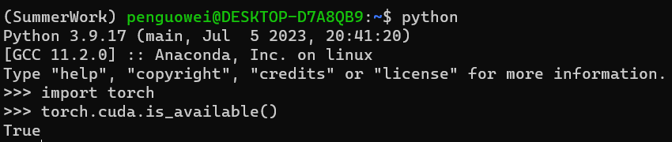

参考链接

- https://blog.csdn.net/qq_46311811/article/details/123524762
- https://blog.csdn.net/ww_khun/article/details/129410363?spm=1001.2101.3001.6650.1&utm_medium=distribute.pc_relevant.none-task-blog-2~default~CTRLIST~Rate-1-129410363-blog-107902689.235%5Ev38%5Epc_relevant_sort_base1&depth_1-utm_source=distribute.pc_relevant.none-task-blog-2~default~CTRLIST~Rate-1-129410363-blog-107902689.235%5Ev38%5Epc_relevant_sort_base1&utm_relevant_index=2
- https://blog.csdn.net/weixin_37887116/article/details/113725681——jupyter
- https://zhuanlan.zhihu.com/p/411524206

# 一. 配置Anaconda

## 1. 安装anaconda

- 在Anaconda官网上查看Linux版本的安装包地址https://www.anaconda.com/download#downloads


- 获取Anaconda安装包的地址https://repo.anaconda.com/archive/Anaconda3-2023.03-1-Linux-x86_64.sh

```bash
# 在linux中输入下载命令：
penguowei@DESKTOP-D7A8QB9:~$ wget https://repo.anaconda.com/archive/Anaconda3-2023.03-1-Linux-x86_64.sh

# 安装Anaconda
penguowei@DESKTOP-D7A8QB9:~$ bash Anaconda3-2023.03-1-Linux-x86_64.sh

# 将conda添加入系统路径
penguowei@DESKTOP-D7A8QB9:~$ export PATH=/home/penguowei/anaconda3/bin/:$PATH

# 查看conda版本
penguowei@DESKTOP-D7A8QB9:~$ conda -V
```


## 2. 配置anaconda环境

- 添加国内镜像源

  ```bash
  # 查看自己配置了哪些镜像源
  penguowei@DESKTOP-D7A8QB9:~$ conda config --show-sources
  
  # 删除配置的镜像源
  conda config --remove-key channels
  conda config --remove channels http://mirrors.tuna.tsinghua.edu.cn/anaconda/cloud/pytorch/
  ```

- 配置镜像源（参考链接https://blog.csdn.net/ww_khun/article/details/129410363?spm=1001.2101.3001.6650.1&utm_medium=distribute.pc_relevant.none-task-blog-2~default~CTRLIST~Rate-1-129410363-blog-107902689.235%5Ev38%5Epc_relevant_sort_base1&depth_1-utm_source=distribute.pc_relevant.none-task-blog-2~default~CTRLIST~Rate-1-129410363-blog-107902689.235%5Ev38%5Epc_relevant_sort_base1&utm_relevant_index=2）

  ```bash
  vim .condarc
  channels:
    - defaults
  show_channel_urls: true
  default_channels:
    - https://mirrors.tuna.tsinghua.edu.cn/anaconda/pkgs/main
    - https://mirrors.tuna.tsinghua.edu.cn/anaconda/pkgs/r
    - https://mirrors.tuna.tsinghua.edu.cn/anaconda/pkgs/msys2
  custom_channels:
    conda-forge: https://mirrors.tuna.tsinghua.edu.cn/anaconda/cloud
    msys2: https://mirrors.tuna.tsinghua.edu.cn/anaconda/cloud
    bioconda: https://mirrors.tuna.tsinghua.edu.cn/anaconda/cloud
    menpo: https://mirrors.tuna.tsinghua.edu.cn/anaconda/cloud
    pytorch: https://mirrors.tuna.tsinghua.edu.cn/anaconda/cloud
    pytorch-lts: https://mirrors.tuna.tsinghua.edu.cn/anaconda/cloud
    simpleitk: https://mirrors.tuna.tsinghua.edu.cn/anaconda/cloud
  ```

- 创建一个虚拟环境

  ```bash
  # 创建环境
  penguowei@DESKTOP-D7A8QB9:~$ conda create -n SummerWork python=3.9
  
  # 切换虚拟环境
  penguowei@DESKTOP-D7A8QB9:~$ source activate SummerWork
  
  # 查看该环境下安装的包
  (SummerWork) penguowei@DESKTOP-D7A8QB9:~$ conda list
  ```

# 二. 配置PyTorch&CUDA

1. ```bash
   # 查看PC的GPU-CUDA版本
   (SummerWork) penguowei@DESKTOP-D7A8QB9:~$ nvidia-sm
   ```

2. 连接中获取安装方式https://pytorch.org/get-started/locally/

3. ```bash
   # 安装环境
   conda install pytorch torchvision torchaudio pytorch-cuda=11.7 -c pytorch -c nvidia
   
   # 使用pip安装不容易失败
   # 使用 pip 安装
   # 其中具体版本号不确定时，可以仅执行 pip install torch== --extra-index-url https://download.pytorch.org/whl/cu113 (cu113表示cuda11.3版本) ，执行后会提示可以安装的具体版本号。
   pip install torch==1.10.2+cu113 torchvision==0.11.3+cu113 --extra-index-url https://download.pytorch.org/whl/cu113
   
   # 使用 conda 安装
   # 这种方式容易失败，经常自动安装cpu版本，我也很迷
   conda install pytorch torchvision torchaudio cudatoolkit=11.3 -c pytorch
   
   ```
   
4. 验证

   ```bash
   (SummerWork) penguowei@DESKTOP-D7A8QB9:~$ python
   >>> import torch
   >>> torch.cuda.is_available()
   True
   ```

   

# 三. 配置Jupyter

## 1. 配置与安装

1. 安装jupyter

   ```bash
   (SummerWork) penguowei@DESKTOP-D7A8QB9:~$ pip install jupyter notebook
   
   # 生成jupyter配置文件
   (SummerWork) penguowei@DESKTOP-D7A8QB9:~$ jupyter notebook --generate-config
   
   # 配置密码
   (SummerWork) penguowei@DESKTOP-D7A8QB9:~$ jupyter notebook password
   
   # 获取加密的密码，用于配置后续的登录
   (SummerWork) penguowei@DESKTOP-D7A8QB9:~$ vim .jupyter\jupyter_notebook_config.json
   ```

2.  修改配置文件

   ```bash
   (SummerWork) penguowei@DESKTOP-D7A8QB9:~$ vim .jupyter/jupyter_notebook_config.py
   # 修改如下内容
   c.NotebookApp.notebook_dir = ‘./jupyter_project’
   c.NotebookApp.use_redirect_file = False
   c.NotebookApp.password = '填写json文件中获取得到的加密密码'
   ```

3. 将google浏览器设置为打开的默认浏览器

   修改linux配置文件.bashrc

   ```bash
   (SummerWork) penguowei@DESKTOP-D7A8QB9:~$ vim .bashrc
   
   # 修改如下内容
   export BROWSER='/mnt/C:/Program Files/Google/Chrome/Application/chrome.exe'
   ```

4.  配置完成后，输入

   ```bash
   (SummerWork) penguowei@DESKTOP-D7A8QB9:~$ jupyter notebook # 启动
   ```

   

