# 1. 卷积神经网络——以图像分类为例

图像分类：Image Classification

一张彩色图片的表现形式为一个三维的`Tensor`$width\times height\times channels$，彩色图片的通道数为3，对应RGB三原色。

如何将一张图片作为一个特征值输入到神经网络中是问题的关键：

- 最简单粗暴的方式就是将三维的tensor拉直成一个一维的向量，但这样势必会导致参数数量太多

## 1.1 卷积

- 由于图像的综合性，在全连接层中，每一个神经元不一定都要把整个图片当作输入。每一个神经元都只考虑自己的感受野（receptived filed）

  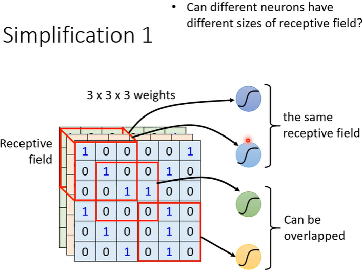

  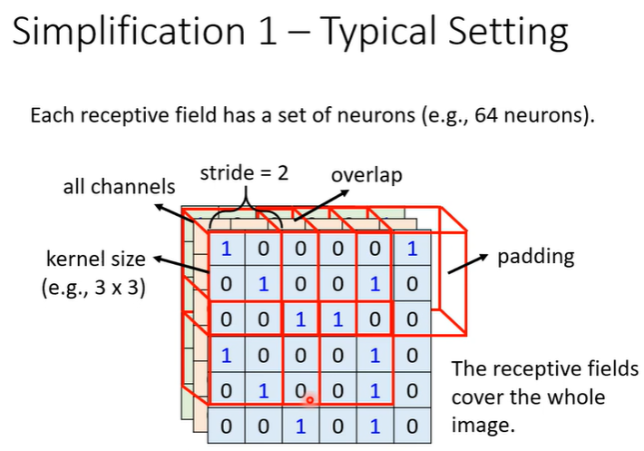

- 参数共享

  不同感受野对应的计算参数是相同的——这组参数叫filter（卷积核的值）

  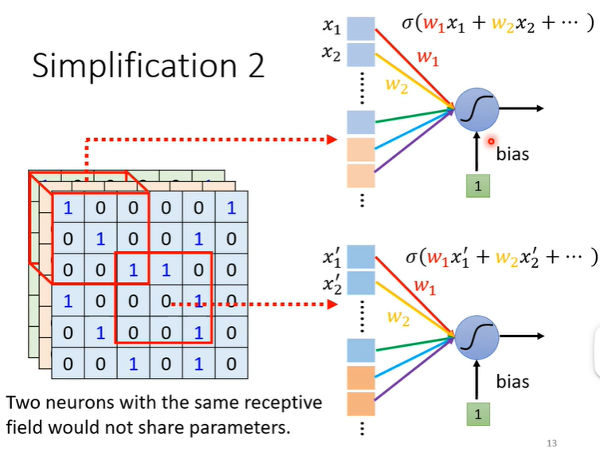

  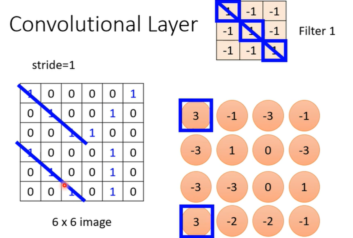

## 1.2 池化

将一张图片进行缩放，对图像的特征是没有影响的。

最大池化：Max Pooling

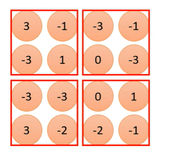 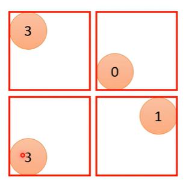 

**即时使用验证集（validation set）也会导致overfitting**

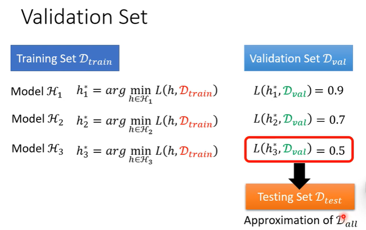

# 2. 为什么需要深度学习

> 为什么是加深网络而不是加宽网络？

对比横向，加深网络在拟合一个function时需要更少的参数量。

以逻辑电路为例：

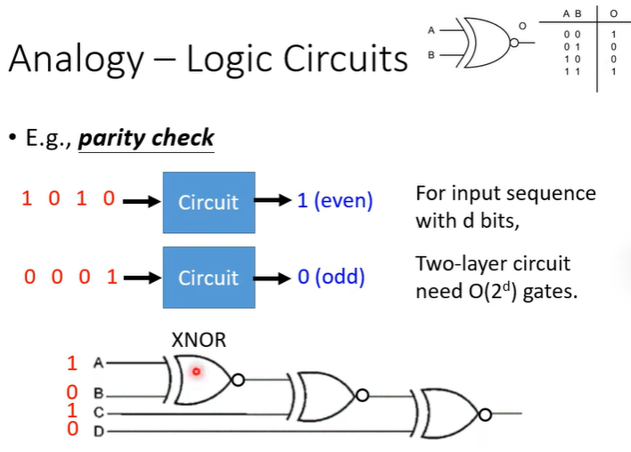

加深网络比加宽网络能用更少的参数，表示更复杂的function

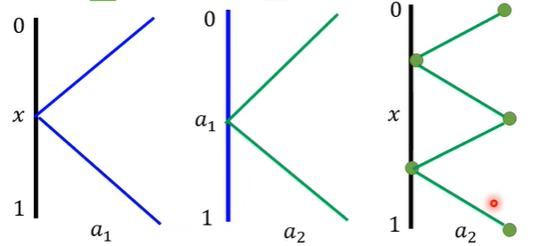

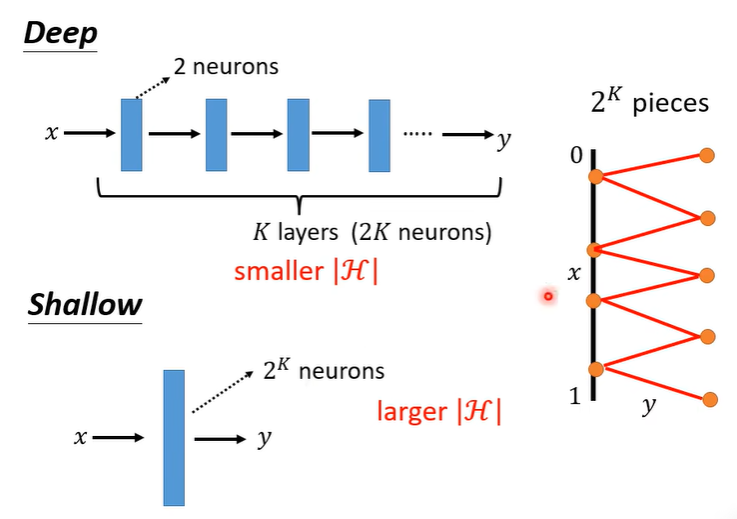

# 3. Spatial Transformer Layer

可以在CNN的任何feature map前加上一层spatial transformer layer，让CNN能够识别旋转、缩放等场景下的图像识别。

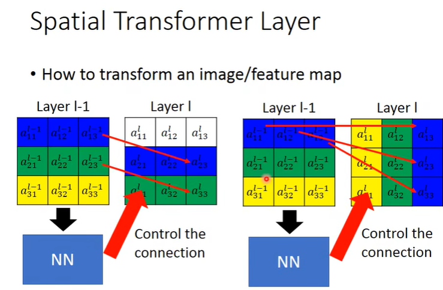

对图像进行放大、缩小、平移、旋转

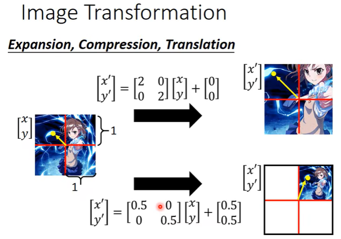 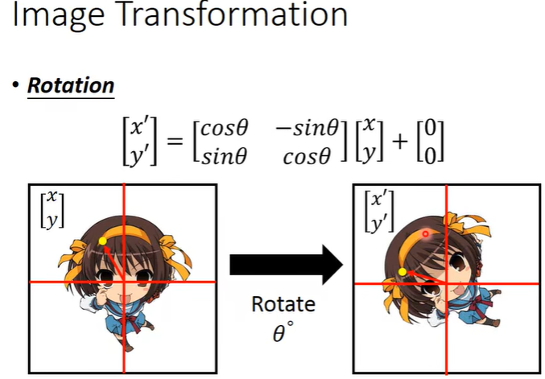  

ST，就是一个NN，输出为一些位置控制的权值，结果是让Layer L与Layer L-1中的点能够固定对应上。

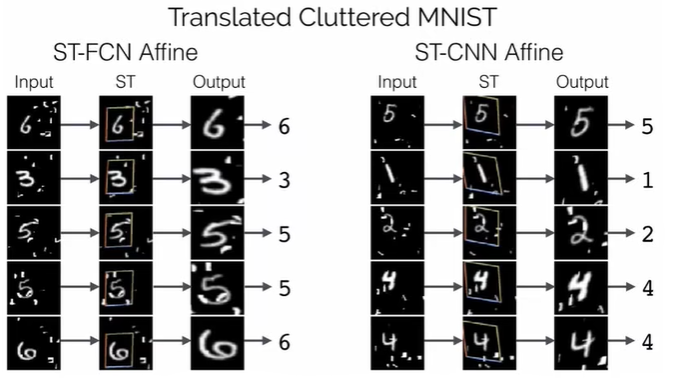

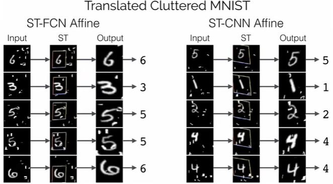

当Imput的位置发生改变时，由于ST参数权值的控制，可以使ST的Output基本不发生变化都集中在需要观察的主体上。