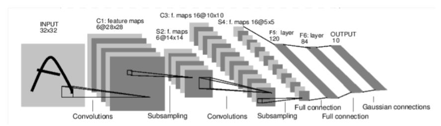
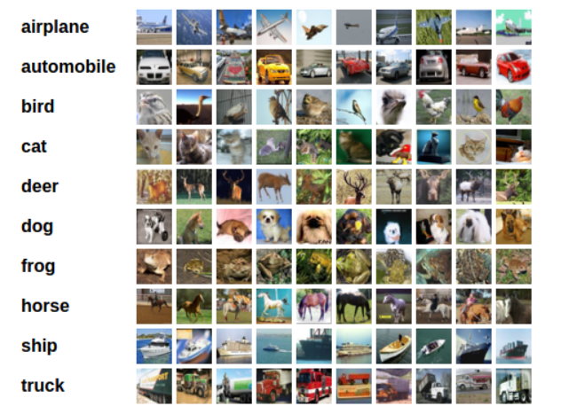
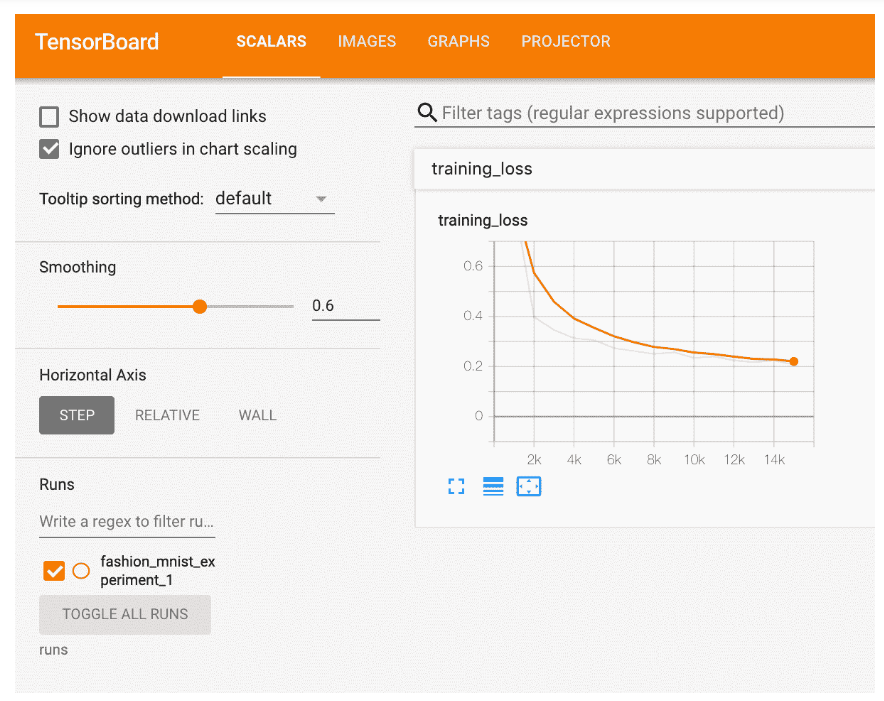

# 1. Autograd：自动求导

`torch.Tensor.requires_grad = True`

如果设置一个张量的`requires_grad = True`，那么pytorch会追踪对该张量的全部操作，并在完成张量的计算后，调用`.backward()`，计算所有的梯度，并将所有梯度自动累加到张量的`.grad`属性中。

通常来说，在不需要计算张量的梯度（测试模型时），将代码块包装在`with torch.no_grad()`中，这样可以避免torch跟踪张量的使用情况，导致占用内存。

Tensor求导实例：

```python
import torch
# 创建一个张量，并设置requires_grad
x = torch.ones(2,2, requires_grad=True)
x
'''
tensor([[1., 1.],
        [1., 1.]], requires_grad=True)
'''
# 对这个张量的每一个元素做一次计算操作
y = x+2
y
'''
tensor([[3., 3.],
        [3., 3.]], grad_fn=<AddBackward0>)
'''
# 做更多计算
z = y*y*3
out = z.mean()
z, out
'''
(tensor([[27., 27.],
         [27., 27.]], grad_fn=<MulBackward0>),
 tensor(27., grad_fn=<MeanBackward0>))
'''
out.backward()
print(x.grad)
'''
tensor([[4.5000, 4.5000],
        [4.5000, 4.5000]])
'''
```

# 2. 神经网络

在pytorch中使用`torch.nn`进行搭建神经网络。

一个神经网络的典型训练过程如下：

- 定义包含一些可学习参数(或者叫权重）的神经网络
- 在输入数据集上迭代
- 通过网络处理输入
- 计算loss(输出和正确答案的距离）
- 将梯度反向传播给网络的参数
- 更新网络的权重，一般使用一个简单的规则：`weight = weight - learning_rate * gradient`



以卷积神经网络进行手写数字识别为例：

```python
import torch
import torch.nn as nn
import torch.nn.functional as F

class MyModel(nn.Module):
    def __init__(self):
        super(MyModel, self).__init__()

        # 输入图像channel为1，第一层输出channel为6， 卷积核大小为5*5
        # 定义卷积层
        self.conv1 = nn.Conv2d(1, 6, 5)
        self.con2 = nn.Conv2d(6, 16, 5)

        # 全连接层
        self.fc1 = nn.Linear(16 * 5 * 5, 120)
        self.fc2 = nn.Linear(120, 84)
        self.fc3 = nn.Linear(84, 10)

    def forward(self, x):
        x = self.conv1(x)
        x = F.relu(x)
        # 做max-pooling
        x = F.max_pool2d(x, (2,2))

        x = self.conv2(x)
        x = F.relu(x)
        # 做max-pooling
        x = F.max_pool2d(x, (2,2))

        x = x.view(-1, self.num_flat_features(x))

        x = F.relu(self.fc1(x))
        x = F.relu(self.fc2(x))
        x = self.fc3(x)
        return x
    
    def num_flat_features(self, x):
        size = x.size()[1:]  # 除去批处理维度的其他所有维度
        num_features = 1
        for s in size:
            num_features *= s
        return num_features
    
net = MyModel()
print(net)

'''
MyModel(
  (conv1): Conv2d(1, 6, kernel_size=(5, 5), stride=(1, 1))
  (con2): Conv2d(6, 16, kernel_size=(5, 5), stride=(1, 1))
  (fc1): Linear(in_features=400, out_features=120, bias=True)
  (fc2): Linear(in_features=120, out_features=84, bias=True)
  (fc3): Linear(in_features=84, out_features=10, bias=True)
)
'''
```

> 值得注意的是，在network构建当中，偏置项（bias）的参数是额外存储在parameters中的，看下面这段代码：net_1是第一层卷积神经网络卷积核的（bias），由于卷积神经网络中每一个channel共用同一组参数，因此，bias为6.

```python
params = list(net.parameters())
print(len(params))

for i in range(len(params)):
    print('net_{}:'.format(i))
    print(params[i].size())  # conv1's .weight
'''
10
net_0:torch.Size([6, 1, 5, 5])
net_1:torch.Size([6])
net_2:torch.Size([16, 6, 5, 5])
net_3:torch.Size([16])
net_4:torch.Size([120, 400])
net_5:torch.Size([120])
net_6:torch.Size([84, 120])
net_7:torch.Size([84])
net_8:torch.Size([10, 84])
net_9:torch.Size([10])
'''
```

> 参数的训练是用backward 进行梯度的计算，并用optimizor进行参数的更新

```python
import torch.optim as optim

# 创建优化器(optimizer）
optimizer = optim.SGD(net.parameters(), lr=0.01)

# 在训练的迭代中：
loss = criterion(out, target)
loss.backward()
print('conv1.bias befor opt')
print(net.conv1.bias)
print('conv1.bias.grad befor opt')
print(net.conv1.bias.grad)

optimizer.step()    # 更新参数
print('conv1.bias after opt')
print(net.conv1.bias)
"""
conv1.bias befor opt
Parameter containing:
tensor([ 0.1593, -0.1954, -0.1997,  0.0782, -0.1261,  0.0591],
       requires_grad=True)
conv1.bias.grad befor opt
tensor([-0.0021,  0.0097,  0.0098, -0.0138,  0.0092,  0.0009])
conv1.bias after opt
Parameter containing:
tensor([ 0.1593, -0.1955, -0.1998,  0.0783, -0.1262,  0.0590],
       requires_grad=True)
"""
```

# 3. 训练一个分类器

在训练神经网络时肯定不止一个训练数据，那么如何对大批量的数据进行操作呢。pytorch针对图像数据创建了一个包`torchvision`，并利用其中的`torchvision.datasets`，`torchvision.utils.data.Dataloader`进行图像数据的操作。

下面以CIFAR10数据集为例说明，进行一个包括“飞机”，“汽车”，“鸟”，“猫”，“鹿”，“狗”，“青蛙”，“马”，“船”，“卡车”，10类图像的分类。



1. 通过`torchvision`加载CIFAR10里面的训练和测试数据集，并对数据进行标准化
2. 定义卷积神经网络
3. 定义损失函数
4. 利用训练数据训练网络
5. 利用测试数据测试网络

> 数据的标准化处理是一件很重要的事情，需要将数据分装到`dataset`和`dataloader`中，以便在后续的训练阶段可以批量数据训练，这一部分在下一节中进行详细介绍。

```python
# torch.utils.data.DataLoader
trainloader = torch.utils.data.DataLoader(trainset, batch_size=4, shuffle=True, num_workers=2)
```

> 在训练阶段可以使用`enumerate()`对数据进行batch size的循环训练

```python
for i, data in enumerate(trainloader, 0):
        # get the inputs
        inputs, labels = data

        # zero the parameter gradients
        optimizer.zero_grad()

        # forward + backward + optimize
        outputs = net(inputs)
        loss = criterion(outputs, labels)
        loss.backward()
        optimizer.step()
```

> 模型的保存、读取已训练模型、用GPU加速训练

```python
# torch.save
PATH = './cifar_net.pth'
torch.save(net.state_dict(), PATH)

# net.load_state_dict()
net.load_state_dict(torch.load(PATH))

# 需要将输入和目标在每一步都送入GPU
device = torch.device("cuda:0" if torch.cuda.is_available() else "cpu")
net.to(device)
```

# 4. 多GPU并行训练

> 在多GPU上执行正向和反向传播是自然而然的事。然而，PyTorch默认将只是用一个GPU。你可以使用`DataParallel`让模型并行运行来轻易的在多个GPU上运行`DataParallel`自动的划分数据，并将作业顺序发送到多个GPU上的多个模型。`DataParallel`会在每个模型完成作业后，收集与合并结果然后返回给你

```python
model = nn.DataParallel(model)
```

```python
class Model(nn.Module):
    # Our model

    def __init__(self, input_size, output_size):
        super(Model, self).__init__()
        self.fc = nn.Linear(input_size, output_size)

    def forward(self, input):
        output = self.fc(input)
        print("\tIn Model: input size", input.size(),
              "output size", output.size())
        return output

model = Model(input_size, output_size)
if torch.cuda.device_count() > 1: 
  print("Let's use", torch.cuda.device_count(), "GPUs!")
  # dim = 0 [30, xxx] -> [10, ...], [10, ...], [10, ...] on 3 GPUs
  model = nn.DataParallel(model)

model.to(device)
```

# 5. 自定义数据集、数据加载器和数据转换

下面以一个对面部轮廓作处理的例子为例说明如何进行数据相关方面的自定义。

> torch.utils.data.Dataset是代表数据集的抽象类。 自定义数据集应继承Dataset并覆盖以下方法：__len__，以便len(dataset)返回数据集的大小。__getitem__支持索引，以便可以使用dataset[i]获取第个样本

```python
import torch
from torch.utils.data import Dataset
class FaceLandmarksDataset(Dataset):
    def __init__(self, csv_file, root_dir, transform = None) :
        self.landmarks_frame = pd.read_csv(csv_file)
        self.root_dir = root_dir
        self.transform = transform

    def __len__(self):
        return len(self.landmarks_frame)

    def __getitem__(self, index) :
        if torch.is_tensor(index):
            index = index.tolist()

        img_name = os.path.join(self.root_dir, self.landmarks_frame.iloc[index, 0])

        image = io.imread(img_name)
        landmarks = self.landmarks_frame.iloc[index, 1:]
        landmarks = np.asanyarray(landmarks)
        landmarks = landmarks.astype('float').reshape(-1, 2)
        
        sample = {'image': image, 'landmarks': landmarks}

        if self.transform:
            sample = self.transform(sample)

        return sample
```

**这一步需要想明白你的训练数据需要返回什么，需要给什么参数。**

> 当然可以使用if训练来遍历每一张图片，但是这样无疑会使程序变得臃肿，并且缺少可扩展性。`torch.utils.data.DataLoader`是提供所有这些功能的迭代器

```python
dataloader = DataLoader(transformed_dataset, batch_size=4,
                        shuffle=True, num_workers=4)
```

# 6. Tensorboard

> 使用tensorboard对模型的训练过程可以有一个直观形象的展示。

```python
from torch.utils.tensorboard import SummaryWriter

# default `log_dir` is "runs" - we'll be more specific here
writer = SummaryWriter('runs/fashion_mnist_experiment_1')

# 写入Tensorboard
# get some random training images
dataiter = iter(trainloader)
images, labels = dataiter.next()

# create grid of images
img_grid = torchvision.utils.make_grid(images)

# show images
matplotlib_imshow(img_grid, one_channel=True)

# write to tensorboard
writer.add_image('four_fashion_mnist_images', img_grid)
```

```bash
tensorboard --logdir=runs
```

> 使用tensorboard检查模型

```python
writer.add_graph(net, images)
writer.close()
```

> 使用tensorboard记录训练的结果or需要看的数据

```python
# ...log the running loss
writer.add_scalar('training loss',
                   running_loss / 1000,
                   epoch*len(trainloader) + i)

writer.add_figure('predictions vs. actuals',
                   plot_classes_preds(net, inputs, labels),
                   global_step=epoch * len(trainloader) + i)
```



