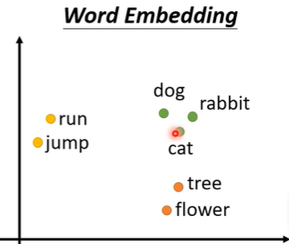
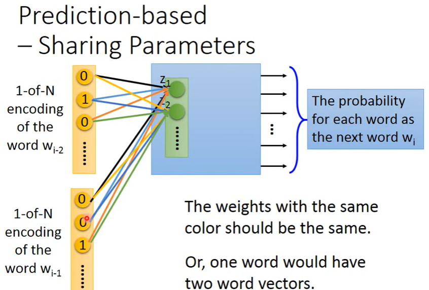
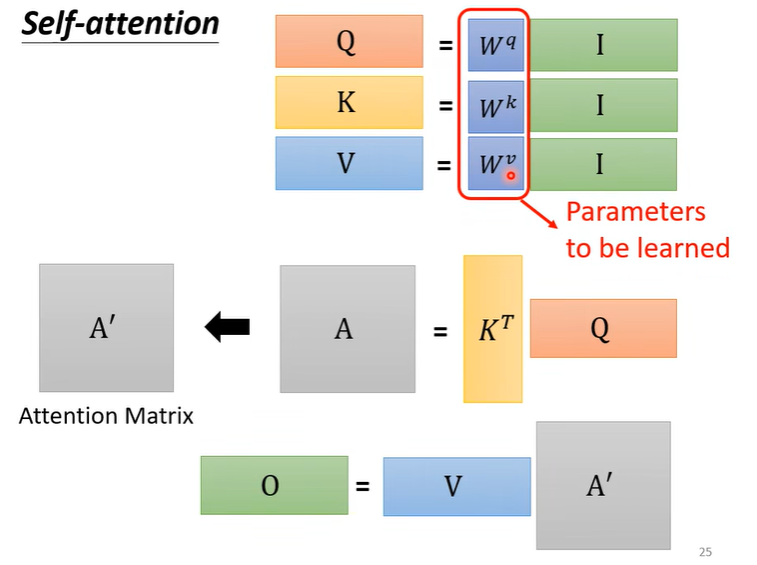
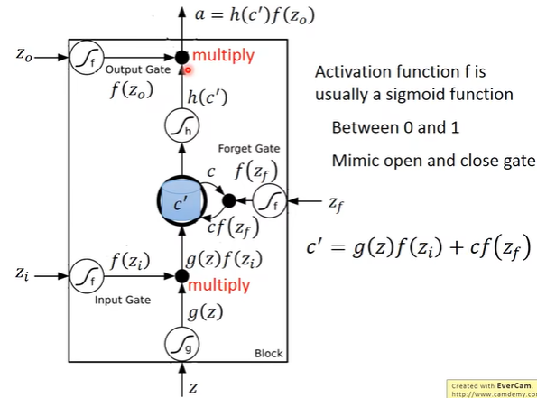

# 一、自注意力机制

> 在之前的学习过程中，输入的特征向量数量都是固定的。图片：28×28的像素矩阵；房价预测：特征值向量。每次输入的特征向量数目都是固定。但是在文本（自然语言）领域，**每次输入的句子长度不可能都是一样的，每个句子的词数目也是不一样的**。 

- 如何将一个词变成一个向量

  - One-hot Encoding

    

    1. 向量长度为世界上所有词汇的数目（==显然不现实==）

    2. 这样的记录方式没有考虑到词汇之间的关系（apple与bag关系不大，但是却挨在一起）——==没有语义关系==

  - Word Embedding

    

    这样的方式就考虑了语义关系，将每个词做Embedding后，有语义关系的词汇会关联在一起。

## 1. Word Embedding

> word embedding实际上是一个无监督学习，unsupervised learning的方式。需要做到的事情就是 ：**学习一个神经网络，当输入一个词汇时，输出的是该词汇对应的word embedding**。==而拥有的训练数据是一堆文字== 

机器通过==学习上下文词义==的方式进行学习如何给一个词汇进行embedding

- Prediction-based

  给当前的词汇 $w_{i-1}$  ，预测下一个词汇 $w_i$ 。

  

  因为大概率上如果一个词汇后面跟的词汇相同时，神经网络在估计下一个词汇的概率时在hidden layer会将当前词汇映射为相似的vector，因此可以用hidden layer来当作词汇的embedding。

  > 当然如果只根据前一个词汇预测后一个词汇，网络学习的难度有点大。因此可以对网络模型进行扩展：使用多个前序的词汇。

  

  在这种做法中，不同前序词连接进网络的**参数要相同**。为了保证当交换词汇位置后，映射到hidden layer中的结果要相同。

  为了保证这样参数相同的效果，当前的做法最多的是：在进网络前，先计算 $x_{i-2}+x_{i-1}$ 

  

> 序列的输出是多种多样的。

- 序列——对应序列数量的标量                        序列——一个标量                                  序列——序列（seq2seq，翻译任务）              

                                           

## 2. Sequence Labeling

> 如果单纯地将每个词汇的向量丢到FC中进行计算，显然是无法处理更复杂的问题的。比如在词性标注中，同一个词（词汇的向量完全一样），可是期待输出的词性却是不一样的。

由于输入的序列词汇数量是不同的，因此不能够构建一个FC将全部词汇综合起来再丢到FC中进行训练。而self-attention这项技术就是来处理这个问题的。

## 3. Self-attention

将原本的词汇向量丢到self-attention中，将对应词汇编码成结合全文后的词汇向量，再丢尽FC中。==self-attention可以叠加很多层==。

> 有关self-attention最知名的文章就是”Attention is all you need“——Transformer。

- Input：可以是模型的最初始输入词汇向量，也可以是某个hidden layer的输出结果当作向量。

- Output：对应输入向量数目相同的输出向量，每一个输出向量都要考虑其他的输入向量。

- ==生成过程（step by step）==以生成 $a^1$ 向量的结果 $b^1$ 为例

  1.  找寻 $a^1$ 与其他向量的关联度 $\alpha$（attention score）

     

     

  2.  根据 $\alpha$ 抽取其余输入向量中的特征。

     

     

  3. 从矩阵角度分析计算过程

     - 每一个输入向量 $a^i$ 都要生成对应的 $q^i,k^i,v^i$ 。

       

     - 每一个 $q^i和k^i$ 做点乘得到attention score。

       

     - 每一个 $v^i$ 与attention score相乘

       

     - 综上在实际计算过程中

       

       ==需要训练的参数就是三个矩阵。==

- Multi-head Self-attention

  

  在生成attention score时，不仅仅考虑一个query矩阵和一个key矩阵，而是考虑两个。

> Self-attention并没有考虑词汇之间的位置关系！

- Positional Encoding

  每一个词汇的位置用一个positional vector $e^i$ 表示

  

  > 如何生成positional Encoding，可以使用不同的方式：hand-craft（人工设置的） or learned by data（从输入词汇向量中学习得到）。

# 二、 Recurrent Neural Network（RNN）

> 以词汇词性标注任务为例，相同词汇，同一个向量在不同语境的情况下输入到神经网络中，需要得到不同的输出，这是普通FC网络无法做到的。解决这一问题的一个方法就是让神经网络==带有记忆==

- 在RNN中每一个hidden layer的输出都会存储到memory中

- 在下一次hidden layer进行计算时需要把memory中的值和输入一起进行计算。

- 由于这种存储memory的操作，RNN的输入向量的顺序是考虑在网络中的。输入向量的顺序不同会导致最终的输出结果不同。

  

   存储hidden layer的值的RNN是==Elman Network==；存储前一个输入的输出的RNN是==Jordan Network==。

- 双向RNN（Bidirectional RNN）

  

## 1. Long Short-term Memory（LSTM）

> 当要存储数据到memory中时，在LSTM中受到限制，需要先通过一个==门==（Input Gate）。门打开的时候才能打数据进行memory中，否则不写入。**什么时候开关门，由网络自己学习控制**。此外，还有一个==Output Gate==用来控制是否可以读取网络的输出。另外还有一个==Forget Gate==，用来控制什么时候将之前存储的memory释放掉。

在简单版本的RNN中，memory cell在每次不同的输入时都会洗掉当前cell的值，因此是short-term；而在LSTM中，由于有一个3个门信号的控制，可以使这个memory-cell中值保存时间更长一点，但依旧会改变，因此叫long short-term memory。

- 输入是$z,z_i,z_f,z_o$ 4个值
- 三个门的激活函数通常是`sigmoid`，为了使的门信号值介于0~1之间。
- $f(z_i)$ 就是控制这次输入的Input要不要进行memory有关的计算
- $f(z_f)=1$ ，门打开其实是要用原本存储在memory cell中的值，==并且更新cell中的值==；$=0$，门关闭，其实才是遗忘，表示忘掉之前memory cell中的值，==将cell中的值遗忘置为0==。
- $f(z_o)$ 就是说能不能输出。

输入向量$x_i$ 时，将$x_i$ 输入进4个参数网络中，得到不同门的输入，再通过一层`sigmoid`则可以得到不同门的激活值。因此LSTM==需要4组参数==。

在此基础上，还将上一层hidden layer的output拼接起来，还将上一层的cell值拼接起来。

## 2. RNN的训练

RNN的训练是一件不容易的事情：

参数的更新，要不然在一些地方梯度十分陡峭，要不然在一些地方梯度什么平坦。

一个解决方法就是对梯度进行==clipping==，当梯度特别大时，将梯度进行剪裁使得梯度更新平稳一点。

导致这种error surface的问题就在于RNN中的memory机制：

- LSTM能够解决RNN梯度特别小的问题（gradient vanish）
  - 在RNN中每一个时间点memory cell中的值都会被覆盖掉，但是在LSTM中除非是选择遗忘掉cell（cell中的值置为0），**cell中的值会于输入的值进行累加存储在cell中**

## 

# 三、类神经网络训练不起来怎么办——Batch Normlization

移山大法，使得Loss函数的曲线能够更加平滑，能够更好地训练

- 为什么会产生在某些地方$w$的梯度很大，某些地方$w$的梯度很小的情况？

  

  考虑上述这个简单的线性函数，当$x_1$的输入很小，而$x_2$的输入很大时，就会出现$w_1$对$L$的变化影响很小，而$w_2$对$L$的影响很大的情况。

  

  为了解决这个问题，可以**使得不同特征维度的输入$x_1,x_2,...$的值限制在同一个范围**

- *feature normalization*

  

  平均值$m_i=\sum_{k=1}^R x_i^k/R$

  标准差（方差的算数平方根）$\sigma_i=\sqrt\frac{\sum_{n=1}^R(x_i^n-m_i)^2}{R}$

  标准化的结果$\widetilde{x}_i^r=\frac{x_i^r-m_i}{\sigma^i}$

  这样标准化后的结果 ===> 平均值为0：$\sum \widetilde{x}_i^r/R=0$，方差为1
  $$
  \sigma ^2=\frac{\sum(\widetilde x_i^r-0)^2}{R}\\
  =\frac{\sum(\frac{x_i^r-m_i}{\sigma _i})^2}{R}\\
  =\frac{\sum\frac{(x_i^r-m_i)^2}{\frac{\sum (x_i^r-m_i)^2}{R}}}{R}\\
  =\frac{\sum(x_i^r-m_i)^2}{\sum(x_i^r-m_i)^2}=1
  $$
  

  对于一个batch的训练资料，计算这个batch数据的$\mu,\sigma$，进行标准化处理。

  **那么当没有batch数据时？**——当在测试时呢？

  

  在测试时，用$\overline \mu,\overline \sigma$代替。

# 四、Transformer

> Sequence-to-sequence(seq2seq)是值输入一个句子，输出一个句子，且输入句子的长度都不等，输出句子的长度不确定。常见的应用案例：==语音辨识==（speech recognition），==机器翻译==（machine translation）。但是seq2seq是一个很强大的模型，可以用在语言模型、声音讯号，甚至图像领域，凡是输出的数量不确定都可以用seq2seq模型来建模。

- 通常一个seq2seq分为两个部分，一个Encoder对Input sequence进行处理；一个Decoder输出output。

## 1. Transformer's Encoder

>Transformer的Encoder在Self-attention的基础上进行了修改

- residual connection

  不是直接用Self-attention的结果，而是还要加上原始的输入。==这种结构其实是残差网络==（residual network）。

  

- Layer normalization

  对同一个feature的不同维做归一化处理（计算平均值和残差）。

  

- 再输入一层FC中，注意这里的输入依旧会用residual network的架构。最后再进行一层layer normalization才是一个Encoder的一个block的输出

  

- 综上

  

## 2. Transformer's Decoder

1. Decoder需要一个==特殊的符号==，这个特殊的符号表示开始进行解码。

2. Decoder接收到一个`Begin`的token后，输出第一个vector，这个vector是可能输出词汇的概率。

   

3. 然后将==第一步输出的词汇向量+`Begin`的token==当作第二次的输入向量。

4. 并持续下去：

   

> Decoder是一个很复杂的过程。不仅要接收自己上一步的输出，还要接收Encoder的输出。但实际上Encoder和Decoder的处理上都是在Self-attention上进行改进。

###  ==Masked==

掩码操作:

在原始的Self-attention中，每一个输入向量的输出都是与其他输入向量相关联的（attention score $\alpha $）而在`Masked Self-attention`中，**不能看之后的输入向量**（这个更符合语言生成吧，根据前文的内容生成后面的内容）：

> Decoder在进行处理时，需要一个`Begin token`，另外，因为在Seq2seq模型中是没有规定输入输出长度的，我们需要机器能够==自己决定什么时候停下来==，因此需要有一个`End token`，当机器输出时，表示结束。

   

> Transformer的一个特点的地方还在于Encoder与Decoder的信息传递——Cross attention。

### ==Cross attention==

值得注意的是：

1. 在decoder输出时，我们在进行decoder中的Masked Self-attention时需要考虑前面decoder的输出，但是在进行下一步的cross attention时，仅需要当前要输出对应的向量，
2. 在cross attention过程Decoder只产生$query\ q矩阵$ ；而Encoder要产生$key\ k矩阵，vector\ v矩阵$ 。

## 3. Transformer's Training

> 在Decoder训练时，Decoder的输入是正确答案，这项技术叫==Teacher Forcing==

1. 测试与训练的mismatch：

   训练机器在开始时要输出”机“，在输入”开始“+”机“时要输出”器“，也就是说在训练时，Decoder能看见正确答案。==问题是==在测试时，是没有正确答案给Decoder看的，测试时Decoder下一个输入是上一个输出，而这个输出是有可能是错误的 ===> 一步错，步步错。

   解决这个的一个方法是，在训练时，给Label就给一些错误的label（scheduled sampling）

2. Decoder的输出

   Decoder的输出是词汇的`softmax`表格，是各个词汇输出的概率，那么每一个输出词汇，怎么选择是一个问题：每一次都选择概率最高的词汇（==greedy Decoding==）；==Beam Search==选择一个综合比较好的路径（不是每一步都选择概率最大的词汇，而是有比较随机的探索。但是这个方法的作用比较有限）：

   - 在有唯一答案的情况下，greedy Decoding还是效果更好的训练方式
   - 在需要Decoder自己做一些探索例如，段落续写、文本生成、语音合成等，需要Beam search。

   

   

# 五、 各式各样神奇的自注意力机制变型

> Self-attention的提出是为了解决输入是一个长度不确定的sequence向量时。对输入的向量求query、key得到attention score矩阵是整个Self-attention技术的痛点，因为这个矩阵会随着输入向量长度的变化而变得特别大。特别是在==图片处理==上，输入的向量长度特别长。

## Local attention & truncated attention

**在算attention score时，只计算相邻token的值**。

事实上，当只能看相邻一定距离的token这种做法和CNN特别相似。因此这种方式可以加快attention score的计算过程，但是不能提高性能。

## Global attention

**用一些special token来替代整个句子的全局信息**。

## Reformer

**通过Clustering分类决定是否要做attention**

在attention score中我们需要注意的是值较大的token，因此有一个加速计算的方法就是，只计算值==可能==较大的token，如何快速分辨值是不是大，将所有的query和key向量进行分类，只对在同一类的token做计算。

   

## Sinkhorn Sorting Network

**参数学习是否需要做attention**

到现在为止，哪些地方需要计算attention score全部是人为的设置。可以根据一个网络自己学习是否要产生attention score的值。

## Linformer

**不需要一个N×N的attention score**

  

挑选关键的K的key向量与query向量计算attention score，再从value向量中挑选K个关键向量，生成Self-attention layer的输出。

## Linear Transformer，performer

**先计算key与value向量的值**

先计算attention score 再计算output实际上运算量因为输入向量的数量而特别大。

先计算key与value向量的值，而计算出这一除的值后，之后只需要用query向量与上一步的值计算计算就可以得到结果，而不用再每一次都计算attention score。

 

 

