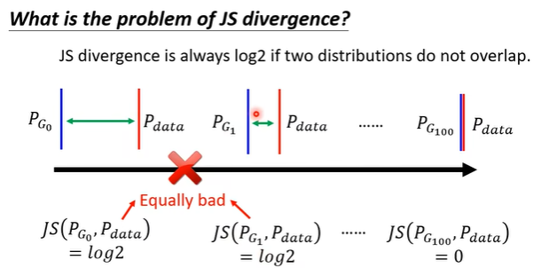
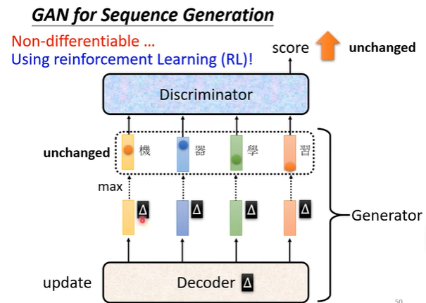

目前学习到的Network可以处理输入是一个值、一张图片、一个向量；输出是一个值、一个向量等。这类神经网络的训练结果是一一对应的，这意味着：在训练好一个神经网络后，如果你向网络输入同样的 $x$ ，那么网络会输出同样的 $y$ 。

Network as generator：在输入 $x$ 的同时加上一个`random variable`（随机变量），这个随机变量是从一组简单分布（高斯分布、平均分布，等）中采样得到的。这样会导致输入同样的 $x$ 能得到不同的 $y$ 

# 为什么需要Generator？

在这个例子中，给出一些之前的游戏画面，让网络预测下一帧的游戏画面，如果按照以前的监督学习的做法：training data中在同一个转角有的向左转、有的向右转；那么网络就要都满足这两种情况，会出现预测结果在同一个转角即会左转，又会右转。

解决这个问题的方式就是给网络加上分布，网络的输出是一个分布，在同一个输入情况下由于有额外的条件分布，就能得到不同的输出分布。

> The same input has different outputs == the task need creativity.

# Generative Adversarial Network(GAN)

 

## Discriminator

评判Generator输出的结果与所需要生成的结果之间的差距。

## Algorithm

首先使用G生成一些图片，然后让D学会去区别生成的图片与真实数据中的图片。

让G学会生成一些分数更高的图片。

反复生成上面的过程。

GAN和一般的机器学习方法没有什么差别：

但问题的关键就是：如何去计算 $P_G, P_{data}$ 之间的差距 `divergence`。

GAN的观点是：只要你能sample出 $P_G, P_{data}$ 就可以计算`divergence`。

我们希望 $V(D,G)$ 越大越好，那么从真实数据中sample得到的 $logD(y\sim P_{data})$ 越大越好，而从生成的数据中sample得到的 $log(1-D(y\sim P_{G}))$ 越小越好。

其实这件事情和二元分类（Binary Classifier）问题十分相似。并且这个目标函数和`cross entropy`很像。

## Training for GAN

GAN是特别难训练的。

$P_G$ 和 $P_{data}$ 的分布重叠的部分是非常小的。也就是说在训练D时，往往会出现很多张生成的图片和很多张真实的图片，因为没有重叠的部分，而D给的分数区别不大，即使两张图片的差距相当大。

$P_{G_0}$ 明明不如 $P_{G_1}$ 但是从给的`divergence`上看不出差别。

换一种更实际的说法：由于生成的图片和真实的图片本来就没有重合的部分（两者差距本来就很大），D很容易就能学到一个function来作区分，但实际上我们希望的是能让生成的图片和真实的图片能越来越相似。**因此使用`JS divergence`来训练D是不容易的事情**。

确保D是个平滑的function。

因此，G和D只要有一方停止训练，另一方就无法进步。

GAN for Sequence Generation

在GAN种，对decoder的参数作一个小小的改动，对结果的影响可能不大，导致整个网络架构是不可微分的，也就无法训练。而使用RL+GAN则使得训练过程难上加难。

## Mode Collapse

生成器G为了让D能够给出很高的分数，可能会选择生成相同的图片。

##  Mode Dropping

 指 GAN 能很好地生成训练集中的数据，但难以生成非训练集的数据，“缺乏想象力”。因为采样数量的局限性，现实中我们无法采集到全部可能的图像，即采集到所有可能的图像是不可能的（如果有能力采集到所有可能的图像，那么我们也就不需要 GAN 来生成图像了），所以通常我们会采样，采集一定数量的图像来代表整个图像分布。**即在D的指导下G能生成与收集的真实数据集很像的图片，但是对于收集以外的数据集就不能生成了。**

## Conditional Generation

回到最开始的话题，目前我们给G的输入都是随机采样分布得到的向量，而这其实并不是很实用。我们希望的是通过添加随机分布来使得输入同一个 $x$ 而输入不同的 $y$ 。

例如`T2I`问题（Text-to-image）:

在加入条件后，如果还用原来的D仅仅评判生成图片和真实数据集之间的差别，会导致生成的图片不管输入的条件。

conditional GAN有很多应用：pix2pix，image transform

## Cycle GAN

### unsupervised learning

如果没有标注过的数据（unpaired data），一个典型的例子就是图片风格转换（image style transfer）：

GAN就收一个随机的分布，再生成一个分布，在unpaired data上，如果我们能够输入一张图片的分布，再给出一张图片的分布：

在这个过程中还是会出现之前conditional GAN遇到的问题，忘掉原始的输入条件，而只专注于输出。那么为了加强输入和输出的关系：训练两个G，两个D，

# Unsupervised Learning

## PixelRNN

输入一个三维的RGB的`vector`输出下一个RGB的`vector`。同时这个方法可以用在语音合成上。

## Variational Autoencoder（VAE）

在encoder的过程中引入一个额外的随机分布采样向量

为什么需要VAE：在原来的encoder中引入noise，使得原来的 点对点生成变成在一个范围内都可以生成对应的结果。这可以使得训练网络在介于两者之间时，能够生成介于两者得结果。

$\sigma_i$ 表示noise的方差（是原始采样出来的noise的几倍几倍这张），由于这种变化幅度肯定为正，因此取$e^{\sigma_i}$ 保证＞0，$e_i$ 是从normal distribution中sample出来的一组数据，它的方差是固定的因为正态分布（高斯分布）$N(\mu,\sigma^2)$ 。

 

我们想要做的就是能够找到一个分布，能够判断说在哪些地方的结果是我们想要的：

## Generative Adversarial Network（GAN）

