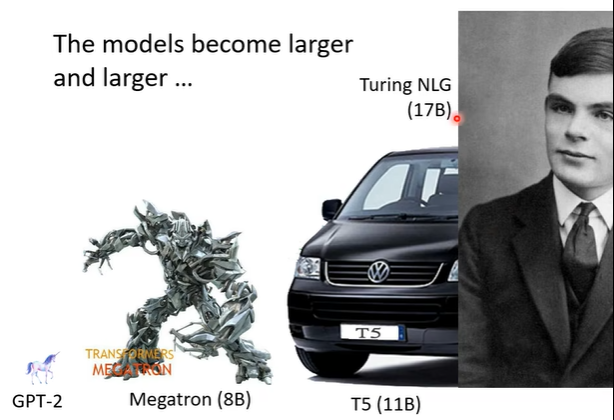
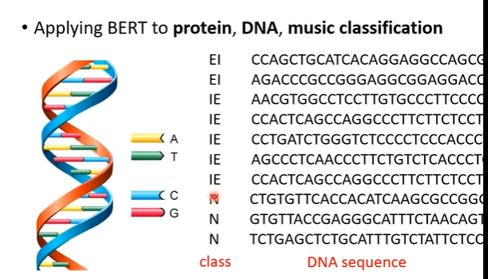

# 自监督学习-Self-Supervised Learning

BERT是一个特别大的模型有340 Million parameters

- supervised learning：有输入和输出label，让模型学习输入和输出的关系

  

- self-supervised learning：假设现在只有输入数据，没有输出数据的label，让模型自己在输入数据的基础上作监督学习。

  

## 1. BERT

1. 输入

   BERT就是一个Transformer的Encoder，输入词汇向量，输出词汇向量

2. Mask

   在输入的词汇向量上作随机的`mask`操作，例如输入100个token时，随机sample其中的一些token“盖住”。“盖住”有两种做法：

   - 将token换成一个special token，这个special token不表示任何的实际意义上的词汇
   - 将token替换成另外的随机的词向量

   

3. 输出

   BERT的输出式针对`mask`掉的token来说的，将`maked token`通过encoder输出的向量经过Linera、Sofmax处理后输出可能词汇的概率。

   

4. 训练

   

   可训练的参数就是BERT中的参数和Linear中的参数

5. Next Sentence Prediction

   BERT会对数据中的两个句子作特殊处理：在两个句子中间加上一个特殊的符号`SEP`代表句子的分割；在整个句子的前面加上符号`CLS`符号。

   `CLS`这个token，需要训练来使其输出是一个二元分类：后面两个句子是否是“相接的”——这个方法对BERT没有什么帮助

   

> 通过`Mask`让BERT学会预测一个token；通过`Next Sentence Prediction`让BERT学会预测句子。仅仅通过这样的自监督训练，神奇的是可以让BERT适应很多下游的任务（Downstream Task）

GLUE（General Language Understanding Evaluation）：评估一个模型在具体下游任务上的表现。GLUE就是一个包含9个任务的评估集。

## 2. How to use BERT

### Case-1 Sentiment analysis

这就是一个具体的下游模型，依旧需要一些有label的数据：（大量的句子，句子的sentiment）来训练整个模型。

### Case-2 `POS` tagging

词性（Part Of Speech）标注

### Case-3 Natural Language Inference

`NLI`：前提（假设）和推断的关系

### Case-4 Extraction-based Question Answering（QA）

输入有文章和问题；输出`s`、`e`，从文章中直接截取答案。

需要从头训练两组向量，可以看作self-attention中的`query`和`key`向量。

黄色向量预测答案的起始位置、蓝色向量预测答案的结束位置。

## 3. Why BERT work？

BERT可以考虑上下文（context），根据上下文的不同，token对应的embedding就不一样。

苹果手机中的“果”的embedding就和电器类token的embedding接近；吃苹果中的“果”的embedding就和草相关的embedding接近。

也就是说：**BERT在训练做填空题的时候，可以真正了解词汇的上下文含义了。**因此可以在接下来的下游任务中处理得很好。这还是得益于self-attention机制。

BERT在DAN分类问题中：

讲A、T、C、G对应于英文中的随机词汇；讲DAN分类问题，转换为英文的Sequence-Class问题，让预训练的BERT处理。讲DAN序列转换为一段没有任何含义的句子，且只有4个词汇，4个词汇还频繁重复出现。**神奇的是，BERT依旧能处理好这样的任务。**

**那么BERT真的能学习到语义吗？**因为在这样一个4个词汇频繁重复的句子中，每个词汇的语义信息是无法用人类的角度来思考的。

## 4. Multi-lingual BERT

用多种语音去训练BERT

Multi-BERT训练好后，仅仅用英文去fine-tune Multi-BERT，Multi-BERT能在未训练的中文测试集上回答问题。

## 5. `GPT`

BERT在预训练时即用self-supervised learning进行学习时做的任务是填空题。而`GPT`在self-supervised learning时做的是预测下一个token`predict Next Token`.

`BOS`：Begin Of Sentence

`GPT`很像Transformer的Decoder部分，BERT则像Encoder部分。因此`GPT`在生成式任务上有很好的表现。

### In-context Learning

给一个任务描述和一些例子，最后给一个prompt希望`GPT`能生成想要的答案。

这种训练并不是要修改`GPT`的参数（这个 过程没有gradient descent），而是说让`GPT`能够学习到这种模式，靠这种模式生成结果，因为预训练阶段`GPT`已经学习了大量的预测下一个token的任务。类似的还有one-shot learning

# 自监督学习用在语音&图像上

> SUPER(**S**peech processing **U**niversal **PER**formance Benchmark)与之前提及到的GLUE相同，是衡量模型在语音处理任务上效果的任务集

## 1. Generative Approaches

使用BERT与`GPT`系列的方法运用在语音领域上：

### `Mockingiay`——学舌鸟

但语音和文字还是有一定的区别，那么有什么需要值得注意的地方吗？

- 声音讯号，token与token之间相连接的部分往往会非常接近，比如说话连续的两个音节是有关联的，机器可能会专注于这种音节的关联而不是声音的含义。因此在使用Mask技术时，要盖住较长的一段声音信号

  

- 由于声音这种奇怪的联系，可以不在时间上mask token，而是在全局上mask掉每个token的某几个维度的值。

  

###  `APC`

Autoregressive Predict Coding

使用`GPT`预测下一个声音讯号是什么

- token与token之间相连接的部分往往会非常接近，因此会让模型预测够远时间上的token

  

## 2. Predictive Approach

让机器预测照片旋转了多少度

让机器预测一张复杂图片的两个小块的方向问题

判断两段声音讯号之间的距离

> 之前的生成式方法都是给模型一些完整的文字、语音、图片，让模型去还原、生成原来的token，这种还原需要掌握原来输入数据复杂的特征表征。有没有一种方法让模型不用去生成复杂的结果，通过简单的结果生成依旧能学到特征分析。

通过上面这些设置的"小任务"，让机器通过一些简单的结果生成，而依旧能够学习到足够的分析效果，使得能在下游任务上依旧有好的表现。

如何设置这样的“小任务”需要根据不同的下游任务进行设置。但也有一些比较通解的方法——让模型生成较为简单的结果。

将声音讯号离散化，不再生成完成的声音讯号而是生成每个音标的标号。

## 3. Contrastive Learning

 生成式和预测试的方法都要生成一些东西，那么是否有方法可以不用生成结果，也依旧能学习到一些东西。

让相关联的输入经过encoder的输出后的向量越接近越好；让不相关的输入经过encoder的输出后的向量越偏离越好。

但是问题是在Self-Supervised Learning中并没有数据的Label，如何判断输入是否相关联呢？

### `SimCLR`

对输入数据做`data augmentation`，同一张图片做增强后的就是positive example；不同图片就是negative example。

## 4. Bootstrapping Approaches

> 如何合理地选择一张negative的图片是一件很难得事情

加了一层predictor且只训练右边的encoder，左边的encoder是右边的copy。这样只用positive example就可以让模型训练起来。

这种方法可以看作知识蒸馏的样子。我们希望模型在看见两张相似的图片的时候能输出相似的向量。那么我们就将原来的（左边的）encoder当作teacher model，训练右边的模型（student model）能够生成与teacher相近的结果。

## 5. Simply Extra Regularization

### `VICReg`

# BERT and Its Family

> 对于NLP领域的问题，以前的做法是一个任务一个模型。这显然是极其耗时和没有效率的一种作法。那么，能不能训练一个模型——**使用没有标注的并且与具体的NLP任务没有关系的资料进行模型的训练**；然后微调这个模型使得这个模型在NLP的具体任务上能够有较好的性能。

这就是当前解NLP问题的一个范式。通过预训练一个模型，再根据具体的下游任务再对模型进行微调。——*这个过程其实很像人类进行学习的过程。例如进行六级测试，不是全部做六级的试卷，而是要在掌握一定英语知识的基础上再通过六级的试题进行训练应试能力。*

## 1. Pre-train Model

> Pre-train Model要做的不是说解决某些问题，而是要让模型能够在大量训练资料的基础上能够理解语义信息。具体来说：“能够将每个token表示成包含上下文讯息的vector”——Represent each token by a embedding vector

- Contextualized Word Embedding

  由于语言系统的复杂性，往往会出现同一个字有不同的含义。因此token—embedding vector过程中必须要考虑token的上下文。

  BERT等模型都是输入一整个sentence，模型看完整个sentence再输出每一个token的embedding vector。

  

## 2. Fine-Tune

Fine-tune整个model的效果比固定住Pre-train model只训练Task的参数效果要好很多。

### Adaptor

但是这样fine-tune整个模型的做法会带来巨大的计算和存储资源开销。每根据一个具体的任务微调整个模型就要重新存储一个新参数的pre-train model。

有没有什么做法能够每次只微调pre-train model的一部分呢？

在Pre-trian model中加入一些Adaptor Layers，每次微调只训练Adaptor的参数。这样的资源开销要小很多。

## 3. BERT Family & GPT

### GPT-3

GPT-3有175B（billion）1.75千亿参数。

GPT系列想要做的事情是：让模型有**zero-shot的本领**。BERT在预训练阶段读了大量的资料后，如果让BERT去解下游任务，依旧要用一些具体任务的标签资料去训练模型，没有办法让BERT直接用在下游任务上。

- In-context Learning

### CoVe

**Co**ntext **Ve**xtor——通过翻译任务让模型能够学习到语义信息

> 如果使用summarize任务呢？在summarize中，有些词不重要会让模型学习到看见这个词就生成不重要的embedding。这种做法不利于学习得到整个句子的语义信息。

> Translation 任务则需要大量的成对标签数据。那么能不能使用不是成对的数据就可以训练模型？——Self-Supervised Learning

- Predic Next Token
- Mask

### SpanBert

一次性盖住较长长度的token，长度由随机采样得到。

- Span Boundary Objective（SBO）

  给mask区域的上下文，让模型预测mask区域中的某个token

  

### XLNet

Transformer-XL

第一种观点：随机打乱sentence的顺序

第二种观点：不会根据整个sentence去预测mask的token只会根据随机的sentence的一些部分去预测mask。

