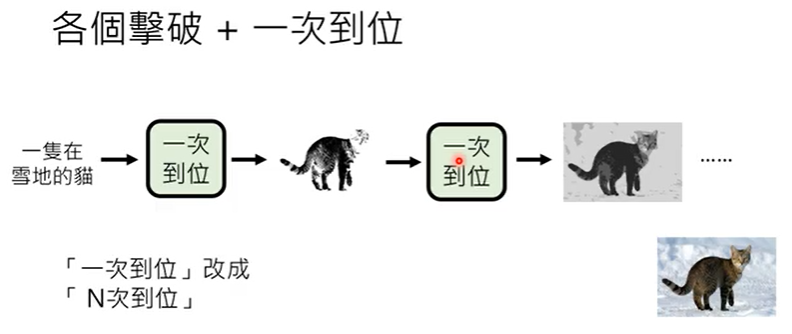
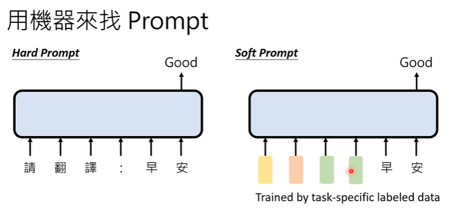

# ChatGPT原理剖析

ChatGPT真正在做的事情就是——“文字接龙”。和我们直接了解到的生成式AI一样：输出的是token的概率分布，并随机从中sample出一些token出来。因此，**ChatGPT每次给的答案都可能不一样**

在每次输入的时候，会将同一则对话中的历史输入一起输入到模型中。

ChatGPT可能由1700亿个参数。

## 1. 预训练（Pre-train）

预训练模型也被称为自监督学习模型（Self-supervised Learning）

**ChatGPT**——**Chat** **G**enerative **P**re-Train **T**ransformer

在一般的机器学习中，需要大量的**成对资料**进行监督学习。

**能够搜集得到的成对资料是很少的**，ChatGPT通过自监督学习的技术能够从网络上学习到很多东西。“网络上每一段文字都可以成为ChatGPT的训练数据”

阅读了《哈利波特》全集30万遍

在ChatGPT之前的GPT系列受限于只能从网络资料学习的缺点，在回答问题的时都是从网络上扒下来的数据中挑出来回答的。

ChatGPT在无监督学习的基础上还加入了监督式学习——让人类来教模型回答问题。

Multi-Language Model（Multi-BERT）：通过多种语言的预训练，只教某一个语言的某一个任务，自动学会其他语言上的其他任务。

PPO强化学习

## 2. 研究问题

- Prompting——如何精准提出需求

  

- Neural Editing——如何更正错误

  

  通过监督式学习，能不能让模型在现有预训练基础上更改输出的回答。

  

- 侦测AI生成的物件

  

- Machine Unlearning——泄密问题

  

# 机器学习基本概念

机器学习就是让机器自动找一个函数

根据函数的输出可以将机器学习分为：

1. 回归（Regression）：函数的输出是一个数值

   

2. 分类（Classification）：函数的输出是一个类别（让机器做选择题）

   

3. 结构化学习（Structure Learning）——生成式学习（Generative Learning）

   

ChatGPT的模型本质上解的是分类问题——在可能输出的token中做选择；但是从用户的角度上说则是生成式问题，输出结构化的文字。

因此，可以理解为ChatGPT将生成式学习问题拆解为多个分类问题。

## 1. 找出函数的三步骤

机器学习找出函数的步骤概括来说就是三步：

1. 设定范围（需要什么样的函数——模型的架构、用什么激活函数等）
2. 设定标准——定义Loss函数
3. 找到函数达成目标——梯度下降

## 2. 决定要找什么样的函数

这是与技术无关的事情，取决于想要做的应用是什么。

## 3. 三步走

1. 选出候选函数的集合——Model

   

2. 决定【评价函数好坏】的标准——定义Loss Function

   使用监督学习时，需要成对的标注资料（Label Data）

   

   Semi-supervised Lerning：只有部分资料有标签

   

3. Optimization

   

### 超参数：

### 训练与测试：

在训练集上获得的好的函数在测试集上表现不好。——overfitting

### 函数模型

可能的函数范围：太大太小都不太行

当训练资料小的时候——函数很可能会学习成硬记答案，类似的这种函数会很多，因此需要把可能的函数范围缩小，避免说让找到的都是硬记答案的函数。

当训练资料很多时，可以将函数范围画的大一点。避免说找不到那一个让Loss最小的函数。

可以通过添加“残差结构、归一化”让函数更快收敛。

# 生成式学习的两种策略

> 生成——生成有结构的复杂物件，生成由最小单位构成的复杂结构。

- 以生成句子为例，句子的构成元素称为token
  - 在中文中，通常一个字就是一个token
  - 在英文中，token不是一个单词（因为生成本质上要做的还是一个分类问题，需要给出下一个token的待选项，而英文词汇是不好穷举的，因此用word piece作为token）

## 1. Autoregressive Model

自回归生成——各个击破，依次输出最小单位。

## 2. Non-autoregressive Model

**N**on-**a**uto**r**egressive Model，NAR，一次性输出需要输出的句子。

这种方式有一个问题就是，**如何决定机器输出什么时候停下来？**

1. 影像生成通常使用NAR，因为影像通常拥有更多的像素点。

2. AR的生成质量高于NAR

   

   AR中，下一个token的生成是与前一个token相关的；而NAR中则无关。

3. AR和NAR的结合

   

   

   - Diffusin Model

   

# Finetuning VS Prompting

- 期待将大语言模型当作“专才”——解决某一个特定的任务

  

- 期待语言模型成为“通才”

  

  在输入之前加入“prompt”——GPT系列需要做的事。

##  1. 如何让模型成为专才

BERT在训练初始就只是学习如何填空，当要求其输出句子时，需要对BERT进行改造。

使用Adapter的好处——不用将模型的参数从头重新训练过。

## 2. 如何让模型成为通才

给出范例让机器回答——In-context Learning

Instruct-Tuning

让机器看得懂人类的指令。

## 3. Chain of Thought（COT）Prompting

> 思维链

在生成一些需要“逻辑推理的”问题回答时，尽管给机器一些prompt、范例，机器的回答效果依旧不是很好。那么思维链的做法就是在给机器范例的同时，给出推断过程。

期待机器在回答问题时，同时写出推论过程，并且，因为机器写了推论过程而能够给出正确答案。

> zero-shot chain of sot

由于推论过程也是需要人写的嘛，但是也没有那么多对应的推论过程可以让机器去训练，因此针对zero-shot问题，只需要在最后加一句“Lets' think step by step”就可以得到好的训练效果

> self-consistency

让模型做好几次推论，可能不同的推论过程有不同的答案。最后选取一个最好的答案。

## 4. 用机器来找Prompt

目前了解到的prompt就是人类给机器一些hint，一些instruct，这些hint和instruct都是人类的语言来描述的。

实际上，可以让输入的prompt是一堆向量。这堆向量的**生成**

- 可以通过具体任务的标签资料训练得到的。

- 甚至可以用RL来训练一个模型生成对应的prompt

  

- 还可以用LLMs本身来寻找适合的prompt

  

# 大模型+大资料

1. Emergent Ability——语言模型能够在某个时间点**“顿悟”** 

   

2. 训练资料需要让模型具有1. 常识知识，2. 任务知识

   

3. 资料的前处理十分重要

   

   - 过滤掉有害的内容
   - 去除网页有关的符号（HTML Tag）
   - 用规则去除低品质的资料
   - 去除重复的资料
   - 设置测试集——Test-set Filtring

# 图像生成模型

图像生成的特殊之处在于，图像生成的结果与原文字的差别大，需要在原文字的基础上想象更多的内容。

使用NAR有个问题：正确答案不止一个！

假如在生成pixel时是彼此独立的，那么很可能导致最后生成的图片极度不协调。

现在成熟的影响生成模型，都在原文字的基础上会加上一个从已知分布中随机采样的向量。

要单纯找一个x，y的对应关系的模型会非常非常难，那么现在的做法是将原始的x看作是条件，而我们要找的**关系是从已知分布中采样的向量与生成y的对应关系**；只不过说，这个生成的y需要考虑条件文字。

## 1. Diffusion Model

1. 从已知分布中Smaple出一个vector，这个vector的大小需要与生成图片的大小一致。

   

2. 通过Denoise对杂讯的图片进行处理

   

3. 会根据Denoise进行的步骤给Denoise一个数值。

4. Denoise

   

5. 我们可以将Denoise看作是在原图片的基础上加noise的反向过程：

   

   其中：step+加上噪音后的图片作为输入，network要能够输出噪音是什么样子

   

   

6. 加上文字的控制条件

   

## 2. Stable Diffusion

目前成熟的T2I模型包含3个module

