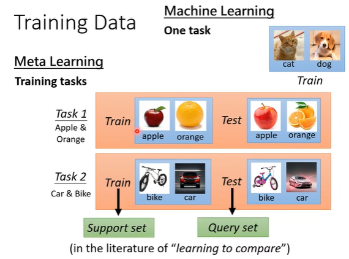
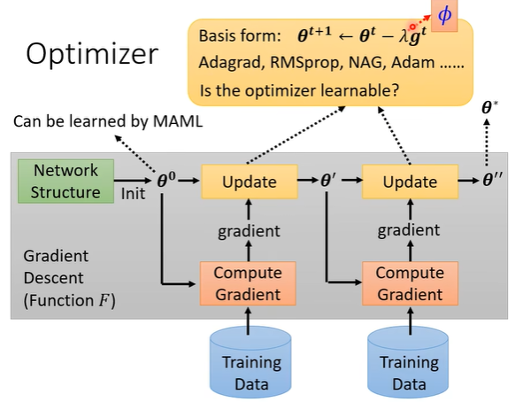
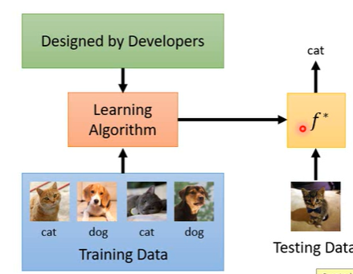

> Meta：元，meta-x：X about X；Meta Learning：Learn to learn

# 一、为什么需要元学习

在工业界可以使用大量的GPU去同时训练多组超参数设置。但是在实验室没有这样大量的计算资源提供。因此，问题的关键就变成能不能让机器自己去学习到一组合适的超参数。

## 1. 回顾ML

Machine Learning就是寻找一个函数。

## 2. 学习去学习

目前位置需要进行梯度下降等等计算的模型都是人为设置的。那么我们能不能用机器学习的概念，让机器自己学习找出这样的模型。

### what is learnable？

在一个模型中，目前认为设定的包括：模型的框架、初始化参数、学习率等超参数。

在元学习中用$\phi$表示想要学习的部分（learnable components）；不同的元学习方法就是学习不同的部分。

### loss function！

$$
Define\ L(\phi)
$$

怎么知道这个$\phi $好不好？

对于任务1通过 $F_\phi$ 找到一组最优的参数 $\theta^{1*}$ ，

如何评判这样的 $\theta^{1*}$ 好不好呢？与机器学习中的步骤是没有什么区别的，在每一个任务中都有训练资料和测试资料。

计算得到的 $l^1$ 越大，说明通过 $\phi$ 找到的参数越不好，那么 $L(\phi)$ 越大。

**在元学习中，不会只在一个任务上进行学习，而是在多个任务上进行学习。**

 

在元学习中，会在大量任务上进行训练。

！！有一个要注意的地方！！

在机器学习中，我们的 $L(\theta)$ 是通过训练资料获得模型，而在测试资料上计算损失函数。而在元学习中，我们就是基于测试资料得到的模型在测试资料上的损失函数。

### optimize！！

问题的关键就在于：$\partial L(\phi)/\partial \phi$ 是不是能计算微分！！

当然如果能微分就用梯度下降；如果不能微分 :) 强化学习！

# 二、ML VS Meta

## 1. 目标不同

## 2. 训练资料不同

 

## 3. Loss损失函数

对于每一个 $l^1$ 都要经过一个完整的训练、测试才能得到损失函数。

# 三、什么是可以被学的

## 1. Learning to initialize

在这个步骤中：初始化参数 $\theta^0$ 是可以学习的

**M**odel-**A**gnostic **M**eta-**L**earning

**Reptile**

元学习的过程，其实与很多概念方法都有相似的地方：预训练（Pre-Train）、域迁移、迁移学习等。元学习在多个任务上学习到的东西，再在其他任务上进行实现（测试）。

## 2. Learning to Optimizer

在优化过程中，包括学习率等参数可不可以被学习出来。

## 3. Learning to Network

如果将网络架构当作学习的部分，那么做微分就有问题了！ :) 强化学习！

## 4. Data processing

在做训练的时候，需要对数据做Data Augmentation，让机器学习如何进行数据增强。

> 有一个异想天开的想法，能不能输入训练资料、测试资料，模型就能自动输出带有参数的网络。

# 四、Meta VS others

## 1. Meta 与自监督的结合

自监督学习是在预训练的基础上学习到一个较好的初始的网络结构，然后使用微调，针对下游任务再最优化参数。

元学习也有一些方法是针对梯度下降过程中如何进行初始化来学习的（MAML）。

MAML也是要用GD的方法来学习参数的，那么==MAML的GD过程中的初始化参数该怎么设置呢==？ :) 套娃是吧

如果是在NLP上做的话，目前MAML的初始化参数来源就是BERT！

BERT在pre-train做的事情和在下游任务上具体要处理的事情没有关系；而MAML可以在具体的任务上找到更好的训练参数。

## 2. 知识蒸馏和Meta

这个Teacher Net到底能不能用来进行学习？或者说，用Teacher Net能不能教出比较好的Student Net。

结合Meta的思想，让Teacher Net学习如何教学生，Teacher Net的目标是让Student Net能够更好的学习！它的Loss是Student学习结果的Loss。

# 五、Meta Learning

元学习 ==学习去学习==，机器通过在之前任务上积累的经验能够在一个新的任务上有好的表现。==很像自监督== : )

目前的Machine Learning：

## 1. MAML

在训练神经网络的时候需要初始化参数，那么能不能找到一组合适的初始化参数呢，我们用初始化参数为 $\phi$ 的==元学习网络==找到最优的初始化参数 $\theta$ ，在不同的任务上学习到不同的初始化参数 $\hat{\theta}^n$ 

学习到不同的初始化参数 $\hat{\theta}^n$ 后，我们要在任务上训练下去，并计算在这个任务上的损失函数值 $l^n(\hat{\theta}^n)$ 

有 $N$ 个任务，这 $N$ 个任务都使用参数 $\phi$ 的==元学习网络==找到初始化参数并训练结束后，能够得到关于参数 $\phi$ 的损失函数值 $L(\phi)$ 。

**每一个任务的 structure 需要一样！！**

- Reptile

# 

