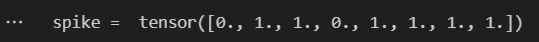
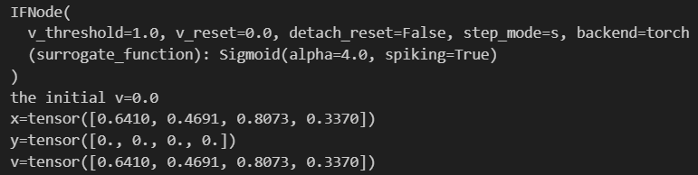
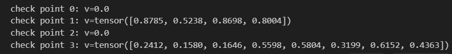
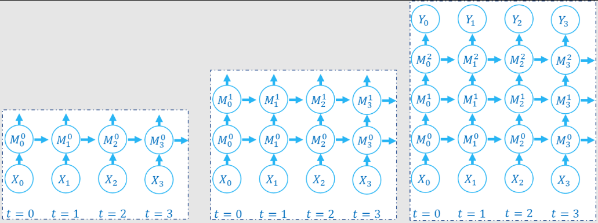
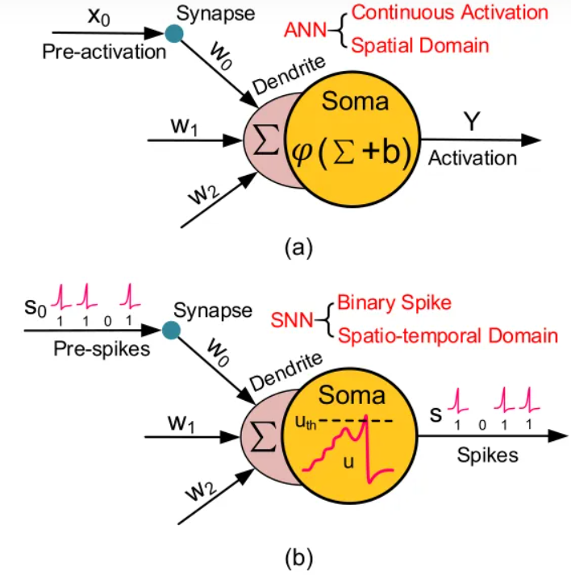

# 基本概念

## 1. 基于激活值的表示方法

`SpikingJelly`框架是基于`PyTorch`的`SNN(Spiking Neural Network)`深度学习框架。 

在Spike中，使用值为 0，1的tensor表示脉冲：

```python
import torch
v = torch.rand([8])
v_th = 0.5
spike = (v >= v_th).to(v)
print('spike = ',spike)
```



```python
'''
spike = (v >= v_th) 这里创建了一个bool 张量，该张量表示v中值是否大于 v_th
.to(v) 则将spike这个bool张量，转换为与v类型相同的张量。
.rand() 表示从均匀分布中随机采样获得长度为8的 张量
'''
```

## 2. 数据格式

在`spikejelly`中数据往往有两种数据：

- 表示单个时刻的数据

  ```python
  shape = [N, *]
  ```

  N 表示 batch的维度；* 表示任意额外的维度

- 表示多个时刻的数据

  ```python
  shape = [T, N, *]
  ```

  T 是时间维度

## 3. 步进模式

`spikingjelly` 中的模块，具有两种传播模式，分别是单步模式(single-step)和多步模式(multi-step)。

在单步模式下，数据使用 `shape = [N, *]` 的格式；

在多步模式下，数据使用 `shape = [T, N, *]` 的格式。

```python
import torch
from spikingjelly.activation_based import neuron

# m，多步模式
net = neuron.IFNode(step_mode='m')

# s，单步模式
net.step_mode = 's'
```

### 单步模式

给单步模式的模块输入 `shape = [T, N, *]` 的序列数据，通常需要手动做一个时间上的循环，将数据拆成 `T` 个 `shape = [N, *]` 的数据并逐步输入进去。

```python
import torch
from spikingjelly.activation_based import neuron

net_s = neuron.IFNode(step_mode='s')
T = 4
N = 1
C = 3
H = 8
W = 8
x_seq = torch.rand([T, N, C, H, W])
y_seq = []
for t in range(T):
    x = x_seq[t]  # x.shape = [N, C, H, W]
    y = net_s(x)  # y.shape = [N, C, H, W]
    y_seq.append(y.unsqueeze(0))

y_seq = torch.cat(y_seq)
# y_seq.shape = [T, N, C, H, W]


# 上述步骤可以用 multi_step_forward() 函数封装
import torch
from spikingjelly.activation_based import neuron, functional
net_s = neuron.IFNode(step_mode='s')
T = 4
N = 1
C = 3
H = 8
W = 8
x_seq = torch.rand([T, N, C, H, W])
y_seq = functional.multi_step_forward(x_seq, net_s)
# y_seq.shape = [T, N, C, H, W]
```

`multi_step_forward()`提供了将 `shape = [T, N, *]` 的序列数据输入到单步模块进行逐步的前向传播的封装

### 多步模式

```python
import torch
from spikingjelly.activation_based import neuron

net_m = neuron.IFNode(step_mode='m')
T = 4
N = 1
C = 3
H = 8
W = 8
x_seq = torch.rand([T, N, C, H, W])
y_seq = net_m(x_seq)
# y_seq.shape = [T, N, C, H, W]
```

为了与老版本 `spikeingJelly` 保持兼容性，所有模块的默认步进模式设置为==单步模式==

## 4. 状态的保存和重置

`spikingjelly.activation_based` 中，状态会被保存在模块内部。

```python
import torch
from spikingjelly.activation_based import neuron

net_s = neuron.IFNode(step_mode='s')
x = torch.rand([4])
print(net_s)
print(f'the initial v={net_s.v}')
y = net_s(x)
print(f'x={x}')
print(f'y={y}')
print(f'v={net_s.v}')
```



在初始化后，IF神经元层的 `v` 会被设置为0，首次给与输入后 `v` 会自动广播到与输入相同的 `shape`。

若我们给与一个新的输入，则应该先清除神经元之前的状态，让其恢复到初始化状态，可以通过调用模块的 `self.reset()` 函数实现：

```python
net_s = neuron.IFNode(step_mode='s')
x = torch.rand([4])
print(f'check point 0: v={net_s.v}')
y = net_s(x)
print(f'check point 1: v={net_s.v}')
net_s.reset()
print(f'check point 2: v={net_s.v}')
x = torch.rand([8])
y = net_s(x)
print(f'check point 3: v={net_s.v}')
```



网络使用了有状态的模块，在训练和推理时，必须==在处理完毕一个batch的数据后进行重置==：

```python
from spikingjelly.activation_based import functional
# ...
for x, label in tqdm(train_data_loader):
    # ...
    optimizer.zero_grad()
    y = net(x)
    loss = criterion(y, label)
    loss.backward()
    optimizer.step()

    functional.reset_net(net)
```

## 5. 传播模式

### 单步模块

若一个网络全部由单步模块构成，则整个网络的计算顺序是按照逐步传播(step-by-step)的模式进行，例如：

```python
for t in range(T):
    x = x_seq[t]
    y = net(x)
    y_seq_step_by_step.append(y.unsqueeze(0))

y_seq_step_by_step = torch.cat(y_seq_step_by_step, 0)
```

### 多半模块

如果网络全部由多步模块构成，则整个网络的计算顺序是按照逐层传播(layer-by-layer)的模式进行，

```python
import torch
import torch.nn as nn
from spikingjelly.activation_based import neuron, functional, layer
T = 4
N = 2
C = 8
x_seq = torch.rand([T, N, C]) * 64.

net = nn.Sequential(
    layer.Linear(C, 4),
    neuron.IFNode(),
    layer.Linear(4, 2),
    neuron.IFNode()
)

functional.set_step_mode(net, step_mode='m')
with torch.no_grad():
    y_seq_layer_by_layer = x_seq
    for i in range(net.__len__()):
        y_seq_layer_by_layer = net[i](y_seq_layer_by_layer
                                      
	y_seq_layer_by_layer = net(x_seq)
```

逐步传播和逐层传播，实际上只是计算顺序不同，它们的==计算结果是完全相同==的：

`SNN`的计算图有2个维度，分别是时间步数和网络深度，网络的传播实际上就是生成完整计算图的过程，正如上面的2张图片所示。实际上，逐步传播是深度优先遍历，而逐层传播是广度优先遍历。

尽管两者区别仅在于计算顺序，但计算速度和内存消耗上会略有区别。

- 在使用梯度替代法训练时，通常推荐使用逐层传播。在正确构建网络的情况下，逐层传播的并行度更大，速度更快
- 在内存受限时使用逐步传播，例如`ANN2SNN`任务中需要用到非常大的 `T`。因为在逐层传播模式下，对无状态的层而言，真正的 batch size 是 `TN` 而不是 `N` (参见下一个教程)，当 `T` 太大时内存消耗极大



# 脉冲神经网络

> **第一代神经网络**
>
> 第一代神经网络又称为感知器，在1950年左右被提出来，它的算法只有两层，输入层输出层，主要是线性结构。它不能解决线性不可分的问题，对稍微复杂一些的函数都无能为力，如异或操作。
>
> **第二代神经网络：BP 神经网络**
>
> 为了解决第一代神经网络的缺陷，在1980年左右 Rumelhart、Williams 等人提出第二代神经网络多层感知器 (MLP)。和第一代神经网络相比，第二代在输入层之间有多个隐含层的感知机，可以引入一些非线性的结构，解决了之前无法模拟异或逻辑的缺陷。
>
> 第二代神经网络让科学家们发现神经网络的层数直接决定了它对现实的表达能力，但是随着层数的增加，优化函数愈发容易出现局部最优解的现象，由于存在梯度消失的问题，深层网络往往难以训练，效果还不如浅层网络。
>
> 所有对目前机器学习有所了解的人都听说过这样一个事实：目前的人工神经网络是第二代神经网络。它们通常是全连接的，接收连续的值，输出连续的值。尽管当代神经网络已经让我们在很多领域中实现了突破，但它们**在生物学上是不精确的，其实并不能模仿生物大脑神经元的运作机制**。
>
> **第三代神经网络：脉冲神经网络**
>
> 第三代神经网络，脉冲神经网络 (Spiking Neural Network，SNN) ，旨在弥合神经科学和机器学习之间的差距，**使用最拟合生物神经元机制的模型来进行计算，更接近生物神经元机制。**==SNN 使用脉冲——这是一种发生在时间点上的离散事件——而非常见的连续值。==本质上，一旦神经元达到了某一电位，脉冲就会出现，随后达到电位的神经元会被重置。最常见的模型是 Leaky Integrate-And-Fire (LIF) 模型。此外，SNN 通常是稀疏连接的。



**(b) 图是典型的单个 SNN 神经元，**它的结构与 ANN 神经元相似，但行为不同。脉冲神经元之间的交流通过 binary 的 events（二元事件），而不是连续的激活值。

binary events：例如，有（x1，x2，x3，。。。）的值，简单的一个激活函数（when x > threwshold；spike = 1）


